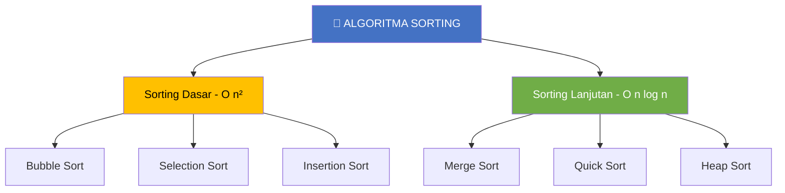
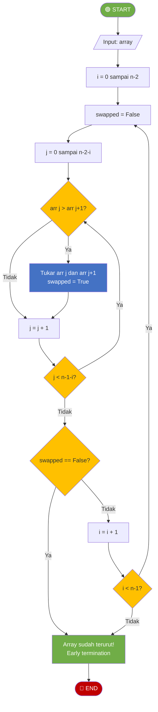
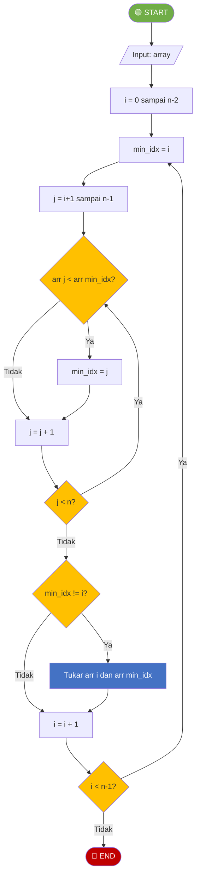
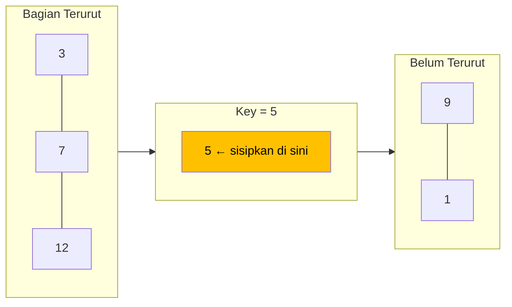
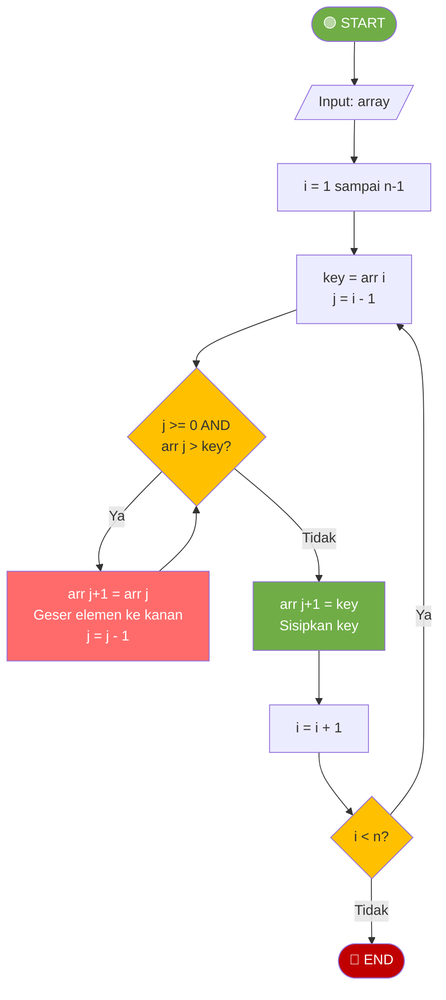
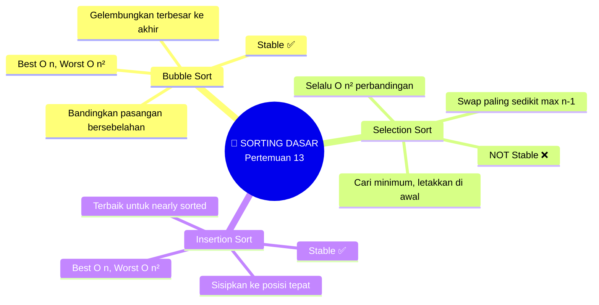

# MODUL 13: SORTING DASAR

---

**Mata Kuliah:** Struktur Data  
**Program Studi:** Sistem Informasi - Institut Teknologi Kalimantan  
**SKS:** 3 (2 Teori + 1 Praktikum)  
**Pertemuan:** 13 dari 16

---

## Estimasi Waktu Pembelajaran

Berdasarkan **Permendikbud No. 3 Tahun 2020** tentang SN-Dikti:

| Komponen | Kegiatan | Durasi |
|----------|----------|--------|
| **TEORI (2 SKS)** | | |
| Tatap Muka | Kuliah di kelas | 100 menit |
| Tugas Terstruktur | Pengembangan dari praktikum (dikumpulkan) | 120 menit |
| Belajar Mandiri | Belajar sendiri | 120 menit |
| **PRAKTIKUM (1 SKS)** | | |
| Kegiatan Lab | Praktikum di lab | 100 menit |
| Belajar Mandiri | Belajar sendiri | 70 menit |
| **TOTAL** | | **510 menit (~8.5 jam)** |

---

## Capaian Pembelajaran

### Sub-CPMK
Setelah menyelesaikan pertemuan ini, mahasiswa mampu:
1. Mengimplementasikan algoritma Bubble Sort, Selection Sort, dan Insertion Sort
2. Menjelaskan cara kerja setiap algoritma melalui trace langkah demi langkah
3. Menganalisis kompleksitas waktu best, average, dan worst case ketiga algoritma
4. Memahami konsep stabilitas sorting dan membedakan algoritma stable vs unstable

### Indikator Pencapaian
- Mahasiswa dapat men-trace proses sorting secara manual untuk setiap algoritma
- Mahasiswa dapat mengimplementasikan ketiga algoritma dalam Python
- Mahasiswa dapat membandingkan performa ketiga algoritma melalui eksperimen
- Mahasiswa dapat menjelaskan kapan suatu algoritma lebih cocok digunakan

---

# BAGIAN A: TATAP MUKA (100 Menit)

## 1. Pendahuluan Sorting (10 menit)

### 1.1 Mengapa Sorting Penting?

**Sorting (pengurutan)** adalah proses menyusun elemen-elemen data ke dalam urutan tertentu (ascending/descending). Sorting adalah salah satu operasi paling mendasar dan paling sering digunakan dalam pemrograman.

> 💡 **Mengapa penting?**
> - Binary Search membutuhkan data terurut → sorting diperlukan
> - Data terurut lebih mudah dibaca dan dianalisis oleh manusia
> - Banyak algoritma lain bekerja lebih efisien pada data terurut
> - Database index, leaderboard, ranking semua memerlukan sorting

### 1.2 Klasifikasi Algoritma Sorting



### 1.3 Konsep Penting: Stabilitas

**Stable sort** menjaga urutan relatif elemen yang memiliki nilai/key yang sama.

**Contoh:** Mengurutkan mahasiswa berdasarkan nilai, yang awalnya terurut berdasarkan nama.

| Data Awal (urut nama) | Stable Sort (urut nilai) | Unstable Sort (urut nilai) |
|------------------------|--------------------------|---------------------------|
| **Andi** - 85 | **Budi** - 75 | **Budi** - 75 |
| **Budi** - 75 | **Citra** - 85 | ~~Citra~~ **Andi** - 85 |
| **Citra** - 85 | **Andi** - 85 | ~~Andi~~ **Citra** - 85 |
| **Dina** - 75 | **Dina** - 75 | **Dina** - 75 |

> 📝 Pada **stable sort**, Andi dan Citra (sama-sama 85) tetap mempertahankan urutan asal (Andi sebelum Citra). Begitu juga Budi dan Dina (sama-sama 75).

### 1.4 Ringkasan Perbandingan

| Algoritma | Best | Average | Worst | Stable? | In-place? |
|-----------|------|---------|-------|---------|-----------|
| Bubble Sort | O(n) | O(n²) | O(n²) | ✅ Ya | ✅ Ya |
| Selection Sort | O(n²) | O(n²) | O(n²) | ❌ Tidak | ✅ Ya |
| Insertion Sort | O(n) | O(n²) | O(n²) | ✅ Ya | ✅ Ya |

> 💡 **In-place** artinya tidak membutuhkan array tambahan yang signifikan — hanya variabel sementara.

---

## 2. Bubble Sort (25 menit)

### 2.1 Konsep

**Bubble Sort** bekerja dengan cara berulang kali **membandingkan pasangan elemen bersebelahan** dan **menukar** jika urutannya salah. Elemen terbesar akan "menggelembung" (bubble) ke posisi akhir.

> 💡 **Analogi:** Bayangkan gelembung udara di dalam air — gelembung besar naik ke atas (posisi akhir) terlebih dahulu.

### 2.2 Flowchart Bubble Sort



### 2.3 Kode Python

```python
def bubble_sort(arr):
    """Bubble Sort dengan optimasi early termination - O(n²)"""
    n = len(arr)
    for i in range(n - 1):
        swapped = False
        for j in range(n - 1 - i):      # Elemen terakhir sudah terurut
            if arr[j] > arr[j + 1]:
                arr[j], arr[j + 1] = arr[j + 1], arr[j]  # Swap
                swapped = True
        if not swapped:                   # Tidak ada swap → sudah terurut
            break
    return arr
```

### 2.4 Trace Bubble Sort

**Array awal:** `[64, 34, 25, 12, 22]`

**Pass 1 (i=0):** Membandingkan pasangan bersebelahan, gelembungkan elemen terbesar ke akhir.

| Langkah | Perbandingan | Aksi | Array |
|---------|-------------|------|-------|
| j=0 | 64 > 34? Ya | Swap | [**34**, **64**, 25, 12, 22] |
| j=1 | 64 > 25? Ya | Swap | [34, **25**, **64**, 12, 22] |
| j=2 | 64 > 12? Ya | Swap | [34, 25, **12**, **64**, 22] |
| j=3 | 64 > 22? Ya | Swap | [34, 25, 12, **22**, **64**] |

> ✅ Setelah Pass 1: `[34, 25, 12, 22, | 64]` — 64 sudah di posisi benar.

**Pass 2 (i=1):**

| Langkah | Perbandingan | Aksi | Array |
|---------|-------------|------|-------|
| j=0 | 34 > 25? Ya | Swap | [**25**, **34**, 12, 22, 64] |
| j=1 | 34 > 12? Ya | Swap | [25, **12**, **34**, 22, 64] |
| j=2 | 34 > 22? Ya | Swap | [25, 12, **22**, **34**, 64] |

> ✅ Setelah Pass 2: `[25, 12, 22, | 34, 64]`

**Pass 3 (i=2):**

| Langkah | Perbandingan | Aksi | Array |
|---------|-------------|------|-------|
| j=0 | 25 > 12? Ya | Swap | [**12**, **25**, 22, 34, 64] |
| j=1 | 25 > 22? Ya | Swap | [12, **22**, **25**, 34, 64] |

> ✅ Setelah Pass 3: `[12, 22, | 25, 34, 64]`

**Pass 4 (i=3):**

| Langkah | Perbandingan | Aksi | Array |
|---------|-------------|------|-------|
| j=0 | 12 > 22? Tidak | - | [12, 22, 25, 34, 64] |

> ✅ Tidak ada swap → **early termination!** Array sudah terurut.

**Hasil akhir:** `[12, 22, 25, 34, 64]`

### 2.5 Analisis Kompleksitas

| Kasus | Kondisi | Perbandingan | Swap | Kompleksitas |
|-------|---------|--------------|------|--------------|
| Best | Sudah terurut | n-1 (1 pass, no swap) | 0 | **O(n)** |
| Average | Random | ~n²/4 | ~n²/4 | **O(n²)** |
| Worst | Terurut terbalik | n(n-1)/2 | n(n-1)/2 | **O(n²)** |

---

## 3. Selection Sort (25 menit)

### 3.1 Konsep

**Selection Sort** bekerja dengan cara **mencari elemen terkecil** dari bagian yang belum terurut, lalu **meletakkannya di posisi yang tepat**. Seperti memilih (select) kartu terkecil satu per satu.

> 💡 **Analogi:** Anda menyortir setumpuk kartu. Setiap kali, Anda cari kartu terkecil dari sisa tumpukan, lalu letakkan di posisi paling depan.

### 3.2 Flowchart Selection Sort



### 3.3 Kode Python

```python
def selection_sort(arr):
    """Selection Sort - O(n²)"""
    n = len(arr)
    for i in range(n - 1):
        min_idx = i
        for j in range(i + 1, n):       # Cari elemen terkecil
            if arr[j] < arr[min_idx]:
                min_idx = j
        if min_idx != i:
            arr[i], arr[min_idx] = arr[min_idx], arr[i]  # Swap
    return arr
```

### 3.4 Trace Selection Sort

**Array awal:** `[64, 25, 12, 22, 11]`

**Pass 1 (i=0):** Cari minimum dari seluruh array.

| Langkah | Proses | min_idx | min_val |
|---------|--------|---------|---------|
| j=1 | 25 < 64? Ya | 1 | 25 |
| j=2 | 12 < 25? Ya | 2 | 12 |
| j=3 | 22 < 12? Tidak | 2 | 12 |
| j=4 | 11 < 12? Ya | 4 | 11 |
| Swap | arr[0] ↔ arr[4] | | |

> ✅ Setelah Pass 1: `[11, | 25, 12, 22, 64]` — 11 sudah di posisi benar.

**Pass 2 (i=1):** Cari minimum dari index 1 sampai akhir.

| Langkah | Proses | min_idx | min_val |
|---------|--------|---------|---------|
| j=2 | 12 < 25? Ya | 2 | 12 |
| j=3 | 22 < 12? Tidak | 2 | 12 |
| j=4 | 64 < 12? Tidak | 2 | 12 |
| Swap | arr[1] ↔ arr[2] | | |

> ✅ Setelah Pass 2: `[11, 12, | 25, 22, 64]`

**Pass 3 (i=2):** Cari minimum dari index 2 sampai akhir.

| Langkah | Proses | min_idx | min_val |
|---------|--------|---------|---------|
| j=3 | 22 < 25? Ya | 3 | 22 |
| j=4 | 64 < 22? Tidak | 3 | 22 |
| Swap | arr[2] ↔ arr[3] | | |

> ✅ Setelah Pass 3: `[11, 12, 22, | 25, 64]`

**Pass 4 (i=3):** Cari minimum dari index 3 sampai akhir.

| Langkah | Proses | min_idx |
|---------|--------|---------|
| j=4 | 64 < 25? Tidak | 3 |
| Swap | Tidak perlu (min_idx == i) | |

> ✅ Setelah Pass 4: `[11, 12, 22, 25, | 64]`

**Hasil akhir:** `[11, 12, 22, 25, 64]`

### 3.5 Analisis Kompleksitas

| Kasus | Kondisi | Perbandingan | Swap | Kompleksitas |
|-------|---------|--------------|------|--------------|
| Best | Sudah terurut | n(n-1)/2 | 0 | **O(n²)** |
| Average | Random | n(n-1)/2 | ~n | **O(n²)** |
| Worst | Terurut terbalik | n(n-1)/2 | n-1 | **O(n²)** |

> 📝 **Catatan:** Selection Sort selalu melakukan **jumlah perbandingan yang sama** terlepas dari kondisi data. Namun jumlah **swap paling sedikit** (maksimal n-1 swap) dibanding Bubble Sort.

### 3.6 Mengapa Selection Sort Tidak Stable?

```
Data:  [(B, 3), (A, 3), (C, 1)]   → sort by angka
                                      
Posisi:    0        1        2

Pass 1: min = (C,1) di index 2, swap dengan index 0
        [(C, 1), (A, 3), (B, 3)]
                           ↑ B sekarang di belakang A

Hasil:  [(C, 1), (A, 3), (B, 3)]  → (A,3) dan (B,3) → B pindah ke belakang A
        Awalnya B sebelum A → TIDAK STABLE!
```

---

## 4. Insertion Sort (25 menit)

### 4.1 Konsep

**Insertion Sort** bekerja seperti menyortir kartu di tangan. Ambil satu kartu, lalu **sisipkan** ke posisi yang tepat di bagian yang sudah terurut.

> 💡 **Analogi:** Saat bermain kartu, Anda mengambil kartu satu per satu dan menyisipkannya ke posisi yang tepat di tangan Anda agar selalu terurut.



Setelah insert: `[3, 5, 7, 12, | 9, 1]`

### 4.2 Flowchart Insertion Sort



### 4.3 Kode Python

```python
def insertion_sort(arr):
    """Insertion Sort - O(n²) worst, O(n) best"""
    n = len(arr)
    for i in range(1, n):
        key = arr[i]                    # Simpan elemen yang akan disisipkan
        j = i - 1
        while j >= 0 and arr[j] > key: # Geser elemen yang lebih besar ke kanan
            arr[j + 1] = arr[j]
            j -= 1
        arr[j + 1] = key               # Sisipkan key di posisi yang tepat
    return arr
```

### 4.4 Trace Insertion Sort

**Array awal:** `[64, 34, 25, 12, 22]`

**Pass 1 (i=1):** key = 34, sisipkan ke bagian terurut `[64]`

| Langkah | Proses | Array |
|---------|--------|-------|
| j=0 | 64 > 34? Ya → geser 64 ke kanan | [64, **64**, 25, 12, 22] |
| j=-1 | Berhenti, sisipkan 34 di j+1=0 | [**34**, 64, 25, 12, 22] |

> ✅ Bagian terurut: `[34, 64]`

**Pass 2 (i=2):** key = 25, sisipkan ke `[34, 64]`

| Langkah | Proses | Array |
|---------|--------|-------|
| j=1 | 64 > 25? Ya → geser | [34, 64, **64**, 12, 22] |
| j=0 | 34 > 25? Ya → geser | [34, **34**, 64, 12, 22] |
| j=-1 | Berhenti, sisipkan 25 di j+1=0 | [**25**, 34, 64, 12, 22] |

> ✅ Bagian terurut: `[25, 34, 64]`

**Pass 3 (i=3):** key = 12, sisipkan ke `[25, 34, 64]`

| Langkah | Proses | Array |
|---------|--------|-------|
| j=2 | 64 > 12? Ya → geser | [25, 34, 64, **64**, 22] |
| j=1 | 34 > 12? Ya → geser | [25, 34, **34**, 64, 22] |
| j=0 | 25 > 12? Ya → geser | [25, **25**, 34, 64, 22] |
| j=-1 | Berhenti, sisipkan 12 di j+1=0 | [**12**, 25, 34, 64, 22] |

> ✅ Bagian terurut: `[12, 25, 34, 64]`

**Pass 4 (i=4):** key = 22, sisipkan ke `[12, 25, 34, 64]`

| Langkah | Proses | Array |
|---------|--------|-------|
| j=3 | 64 > 22? Ya → geser | [12, 25, 34, 64, **64**] |
| j=2 | 34 > 22? Ya → geser | [12, 25, 34, **34**, 64] |
| j=1 | 25 > 22? Ya → geser | [12, 25, **25**, 34, 64] |
| j=0 | 12 > 22? Tidak → berhenti | |
| | Sisipkan 22 di j+1=1 | [12, **22**, 25, 34, 64] |

> ✅ **Hasil akhir:** `[12, 22, 25, 34, 64]`

### 4.5 Analisis Kompleksitas

| Kasus | Kondisi | Perbandingan | Geser | Kompleksitas |
|-------|---------|--------------|-------|--------------|
| Best | Sudah terurut | n-1 | 0 | **O(n)** |
| Average | Random | ~n²/4 | ~n²/4 | **O(n²)** |
| Worst | Terurut terbalik | n(n-1)/2 | n(n-1)/2 | **O(n²)** |

> 💡 **Insertion Sort sangat efisien untuk:**
> - Data yang **hampir terurut** (nearly sorted) → mendekati O(n)
> - Data **berukuran kecil** (n < 50)
> - **Online sorting** (data datang satu per satu)

### 4.6 Mengapa Insertion Sort Stable?

Insertion Sort hanya menggeser elemen yang **strictly greater** (`arr[j] > key`), bukan greater-equal. Jadi elemen dengan nilai sama tidak pernah berpindah urutan relatifnya.

---

## 5. Rangkuman dan Perbandingan (10 menit — sisa waktu)



### Perbandingan Menyeluruh

| Aspek | Bubble Sort | Selection Sort | Insertion Sort |
|-------|-------------|----------------|----------------|
| **Strategi** | Swap bersebelahan | Pilih minimum | Sisipkan ke posisi tepat |
| **Best Case** | O(n) | O(n²) | O(n) |
| **Worst Case** | O(n²) | O(n²) | O(n²) |
| **Jumlah Swap** | Banyak | Sedikit (max n-1) | Sedang (geser) |
| **Stable** | ✅ Ya | ❌ Tidak | ✅ Ya |
| **Adaptive** | ✅ (early stop) | ❌ | ✅ (nearly sorted) |
| **Cocok untuk** | Edukasi | Swap mahal | Data kecil, nearly sorted |
| **Space** | O(1) | O(1) | O(1) |

### Formula Penting

> **Total perbandingan O(n²):** n(n-1)/2 = 1+2+3+...+(n-1)

> **Stable sort:** Elemen dengan key sama mempertahankan urutan asal

> **Adaptive sort:** Performa membaik jika data sudah hampir terurut

> **Dalam praktik:** Untuk n kecil (< 50), Insertion Sort sering dipilih. Python `sort()` menggunakan **Timsort** yang menggunakan Insertion Sort untuk sub-array kecil.

---

# BAGIAN B: PRAKTIKUM DI LAB (100 Menit)

## Tujuan Praktikum
Mengimplementasikan Bubble Sort, Selection Sort, dan Insertion Sort, serta membandingkan performa ketiganya.

> ⚠️ **Catatan:** Kode yang dibuat di praktikum ini akan **dikembangkan lebih lanjut** di Tugas Terstruktur.

---

## Praktikum 13.1: Implementasi Tiga Algoritma Sorting (40 menit)

### Kode Praktikum

```python
"""
============================================================
PRAKTIKUM 13.1: Implementasi Sorting Dasar
============================================================
Nama  : ____________________
NIM   : ____________________
Kelas : ____________________

Instruksi: 
1. Implementasikan ketiga algoritma sorting
2. Jalankan test cases untuk memastikan implementasi benar
3. SIMPAN FILE INI - akan dikembangkan di Tugas Terstruktur
============================================================
"""

def bubble_sort(arr):
    """
    Bubble Sort dengan optimasi early termination
    Mengembalikan array yang sudah terurut (in-place)
    """
    # TODO: Implementasikan berdasarkan flowchart
    # 1. Loop luar i = 0 sampai n-2
    # 2. Set swapped = False
    # 3. Loop dalam j = 0 sampai n-2-i
    # 4. Jika arr[j] > arr[j+1], swap dan set swapped = True
    # 5. Jika tidak ada swap, break (early termination)
    pass


def selection_sort(arr):
    """
    Selection Sort
    Mengembalikan array yang sudah terurut (in-place)
    """
    # TODO: Implementasikan berdasarkan flowchart
    # 1. Loop luar i = 0 sampai n-2
    # 2. Set min_idx = i
    # 3. Loop dalam j = i+1 sampai n-1, cari min
    # 4. Jika min_idx != i, swap arr[i] dan arr[min_idx]
    pass


def insertion_sort(arr):
    """
    Insertion Sort
    Mengembalikan array yang sudah terurut (in-place)
    """
    # TODO: Implementasikan berdasarkan flowchart
    # 1. Loop i = 1 sampai n-1
    # 2. Simpan key = arr[i], j = i-1
    # 3. Selama j >= 0 dan arr[j] > key: geser arr[j] ke kanan
    # 4. Sisipkan key di arr[j+1]
    pass


# === TEST CASES ===
if __name__ == "__main__":
    print("=" * 50)
    print("TEST SORTING DASAR")
    print("=" * 50)
    
    # Data test
    test_cases = [
        ([64, 34, 25, 12, 22, 11, 90], [11, 12, 22, 25, 34, 64, 90]),
        ([5, 4, 3, 2, 1], [1, 2, 3, 4, 5]),           # Reversed
        ([1, 2, 3, 4, 5], [1, 2, 3, 4, 5]),           # Already sorted
        ([1], [1]),                                      # Single element
        ([], []),                                        # Empty
        ([3, 3, 1, 1, 2], [1, 1, 2, 3, 3]),           # Duplicates
        ([42], [42]),                                    # Single
        ([7, 7, 7, 7], [7, 7, 7, 7]),                 # All same
    ]
    
    # Test Bubble Sort
    print("\n--- Bubble Sort ---")
    for i, (input_arr, expected) in enumerate(test_cases):
        arr = input_arr.copy()
        result = bubble_sort(arr)
        assert result == expected, f"GAGAL Test {i+1}: {input_arr} → {result}, expected {expected}"
    print(f"✓ Semua {len(test_cases)} test PASSED!")
    
    # Test Selection Sort
    print("\n--- Selection Sort ---")
    for i, (input_arr, expected) in enumerate(test_cases):
        arr = input_arr.copy()
        result = selection_sort(arr)
        assert result == expected, f"GAGAL Test {i+1}: {input_arr} → {result}, expected {expected}"
    print(f"✓ Semua {len(test_cases)} test PASSED!")
    
    # Test Insertion Sort
    print("\n--- Insertion Sort ---")
    for i, (input_arr, expected) in enumerate(test_cases):
        arr = input_arr.copy()
        result = insertion_sort(arr)
        assert result == expected, f"GAGAL Test {i+1}: {input_arr} → {result}, expected {expected}"
    print(f"✓ Semua {len(test_cases)} test PASSED!")
    
    print("\n" + "=" * 50)
    print("🎉 SEMUA TEST PASSED!")
    print("=" * 50)
```

---

## Praktikum 13.2: Sorting dengan Penghitung Langkah (30 menit)

### Kode Praktikum

```python
"""
============================================================
PRAKTIKUM 13.2: Sorting dengan Penghitung Langkah
============================================================
Nama  : ____________________
NIM   : ____________________
Kelas : ____________________

Instruksi: 
Implementasikan versi yang menghitung jumlah perbandingan dan swap
============================================================
"""

def bubble_sort_counted(arr):
    """Bubble Sort yang menghitung perbandingan dan swap"""
    n = len(arr)
    comparisons = 0
    swaps = 0
    
    # TODO: Implementasikan
    # Sama seperti bubble_sort, tapi tambahkan counter
    # comparisons += 1 setiap kali membandingkan
    # swaps += 1 setiap kali menukar
    
    return arr, comparisons, swaps


def selection_sort_counted(arr):
    """Selection Sort yang menghitung perbandingan dan swap"""
    n = len(arr)
    comparisons = 0
    swaps = 0
    
    # TODO: Implementasikan
    
    return arr, comparisons, swaps


def insertion_sort_counted(arr):
    """Insertion Sort yang menghitung perbandingan dan shift"""
    n = len(arr)
    comparisons = 0
    shifts = 0
    
    # TODO: Implementasikan
    # shifts += 1 setiap kali menggeser elemen
    
    return arr, comparisons, shifts


# === TEST CASES ===
if __name__ == "__main__":
    print("=" * 60)
    print("PENGHITUNG LANGKAH SORTING")
    print("=" * 60)
    
    test_arrays = {
        "Random":    [64, 34, 25, 12, 22, 11, 90],
        "Sorted":    [11, 12, 22, 25, 34, 64, 90],
        "Reversed":  [90, 64, 34, 25, 22, 12, 11],
        "Nearly":    [11, 12, 25, 22, 34, 64, 90],
    }
    
    for name, arr in test_arrays.items():
        print(f"\n--- Data: {name} = {arr} ---")
        print(f"{'Algoritma':<20} {'Perbandingan':>13} {'Swap/Shift':>11}")
        print("-" * 48)
        
        # Bubble Sort
        a1 = arr.copy()
        _, comp, swp = bubble_sort_counted(a1)
        print(f"{'Bubble Sort':<20} {comp:>13} {swp:>11}")
        
        # Selection Sort
        a2 = arr.copy()
        _, comp, swp = selection_sort_counted(a2)
        print(f"{'Selection Sort':<20} {comp:>13} {swp:>11}")
        
        # Insertion Sort
        a3 = arr.copy()
        _, comp, shf = insertion_sort_counted(a3)
        print(f"{'Insertion Sort':<20} {comp:>13} {shf:>11}")
    
    print("\n" + "=" * 60)
```

---

## Praktikum 13.3: Perbandingan Performa (30 menit)

### Kode Praktikum

```python
"""
============================================================
PRAKTIKUM 13.3: Perbandingan Performa Sorting
============================================================
Nama  : ____________________
NIM   : ____________________
Kelas : ____________________

Instruksi: 
Jalankan kode, amati hasil, dan isi analisis
============================================================
"""

import time
import random


def bubble_sort(arr):
    n = len(arr)
    for i in range(n - 1):
        swapped = False
        for j in range(n - 1 - i):
            if arr[j] > arr[j + 1]:
                arr[j], arr[j + 1] = arr[j + 1], arr[j]
                swapped = True
        if not swapped:
            break
    return arr


def selection_sort(arr):
    n = len(arr)
    for i in range(n - 1):
        min_idx = i
        for j in range(i + 1, n):
            if arr[j] < arr[min_idx]:
                min_idx = j
        if min_idx != i:
            arr[i], arr[min_idx] = arr[min_idx], arr[i]
    return arr


def insertion_sort(arr):
    for i in range(1, len(arr)):
        key = arr[i]
        j = i - 1
        while j >= 0 and arr[j] > key:
            arr[j + 1] = arr[j]
            j -= 1
        arr[j + 1] = key
    return arr


def measure_sort(sort_func, arr):
    start = time.perf_counter()
    sort_func(arr)
    end = time.perf_counter()
    return end - start


if __name__ == "__main__":
    print("=" * 70)
    print("PERBANDINGAN PERFORMA SORTING DASAR")
    print("=" * 70)
    
    sizes = [500, 1000, 2000, 5000, 10000]
    
    # ============ Random Data ============
    print("\n--- Data Acak (Random) ---")
    print(f"{'n':>7} | {'Bubble':>10} | {'Selection':>10} | {'Insertion':>10}")
    print("-" * 50)
    for n in sizes:
        data = [random.randint(1, n * 10) for _ in range(n)]
        
        t_bubble = measure_sort(bubble_sort, data.copy())
        t_selection = measure_sort(selection_sort, data.copy())
        t_insertion = measure_sort(insertion_sort, data.copy())
        
        print(f"{n:>7} | {t_bubble:>9.4f}s | {t_selection:>9.4f}s | {t_insertion:>9.4f}s")
    
    # ============ Sorted Data ============
    print("\n--- Data Sudah Terurut (Best Case) ---")
    print(f"{'n':>7} | {'Bubble':>10} | {'Selection':>10} | {'Insertion':>10}")
    print("-" * 50)
    for n in sizes:
        data = list(range(n))
        
        t_bubble = measure_sort(bubble_sort, data.copy())
        t_selection = measure_sort(selection_sort, data.copy())
        t_insertion = measure_sort(insertion_sort, data.copy())
        
        print(f"{n:>7} | {t_bubble:>9.4f}s | {t_selection:>9.4f}s | {t_insertion:>9.4f}s")
    
    # ============ Reversed Data ============
    print("\n--- Data Terbalik (Worst Case) ---")
    print(f"{'n':>7} | {'Bubble':>10} | {'Selection':>10} | {'Insertion':>10}")
    print("-" * 50)
    for n in sizes:
        data = list(range(n, 0, -1))
        
        t_bubble = measure_sort(bubble_sort, data.copy())
        t_selection = measure_sort(selection_sort, data.copy())
        t_insertion = measure_sort(insertion_sort, data.copy())
        
        print(f"{n:>7} | {t_bubble:>9.4f}s | {t_selection:>9.4f}s | {t_insertion:>9.4f}s")
    
    print("=" * 70)
```

---

# BAGIAN C: TUGAS TERSTRUKTUR (120 Menit)

> 📝 **Pengembangan dari Praktikum**
> 
> Tugas ini mengembangkan kode yang sudah dibuat di praktikum.
> Kerjakan setelah praktikum selesai, kumpulkan pada pertemuan berikutnya.

---

## 📋 Informasi Pengumpulan

| Item | Keterangan |
|------|------------|
| **Deadline** | Pertemuan 14 (sebelum kuliah dimulai) |
| **Format** | File Python (.py) |
| **Nama File** | `Tugas13_NIM_Nama.py` |
| **Pengumpulan** | Upload ke github |

---

## Tugas 1: Sorting dengan Custom Comparator (40 menit)

### Deskripsi
Kembangkan ketiga algoritma sorting agar bisa mengurutkan berdasarkan **custom key** dan mendukung **ascending/descending**.

### Template Kode

```python
"""
============================================================
TUGAS TERSTRUKTUR 13.1: Sorting dengan Custom Comparator
============================================================
Nama  : ____________________
NIM   : ____________________
Kelas : ____________________
============================================================
"""

def bubble_sort_custom(arr, key=None, reverse=False):
    """
    Bubble Sort dengan custom key dan arah
    key: fungsi yang menghasilkan nilai pembanding
         contoh: key=lambda x: x['nilai']
    reverse: True untuk descending
    """
    # TODO: Implementasikan
    # Gunakan key(arr[j]) untuk membandingkan
    # Jika reverse=True, balik operator perbandingan
    pass


def selection_sort_custom(arr, key=None, reverse=False):
    """Selection Sort dengan custom key dan arah"""
    # TODO: Implementasikan
    pass


def insertion_sort_custom(arr, key=None, reverse=False):
    """Insertion Sort dengan custom key dan arah"""
    # TODO: Implementasikan
    pass


# === TEST CASES ===
if __name__ == "__main__":
    print("=" * 50)
    print("TEST SORTING CUSTOM COMPARATOR")
    print("=" * 50)
    
    # Test 1: Sort angka biasa
    arr = [5, 2, 8, 1, 9]
    assert bubble_sort_custom(arr.copy()) == [1, 2, 5, 8, 9], "GAGAL"
    print("✓ Test 1 PASSED: Sort angka ascending")
    
    # Test 2: Sort descending
    assert bubble_sort_custom(arr.copy(), reverse=True) == [9, 8, 5, 2, 1], "GAGAL"
    print("✓ Test 2 PASSED: Sort angka descending")
    
    # Test 3: Sort string berdasarkan panjang
    words = ["python", "c", "javascript", "go", "java"]
    result = insertion_sort_custom(words.copy(), key=lambda x: len(x))
    assert result == ["c", "go", "java", "python", "javascript"], f"GAGAL: {result}"
    print(f"✓ Test 3 PASSED: Sort by length = {result}")
    
    # Test 4: Sort dictionary berdasarkan field tertentu
    students = [
        {"nama": "Andi", "nilai": 85},
        {"nama": "Budi", "nilai": 72},
        {"nama": "Citra", "nilai": 91},
        {"nama": "Dina", "nilai": 78},
    ]
    result = insertion_sort_custom(students.copy(), key=lambda x: x["nilai"])
    names = [s["nama"] for s in result]
    assert names == ["Budi", "Dina", "Andi", "Citra"], f"GAGAL: {names}"
    print(f"✓ Test 4 PASSED: Sort students by nilai = {names}")
    
    # Test 5: Sort descending by nilai
    result = selection_sort_custom(students.copy(), key=lambda x: x["nilai"], reverse=True)
    names = [s["nama"] for s in result]
    assert names == ["Citra", "Andi", "Dina", "Budi"], f"GAGAL: {names}"
    print(f"✓ Test 5 PASSED: Sort by nilai DESC = {names}")
    
    # Test 6: Sort tuple berdasarkan elemen kedua
    pairs = [(3, 'c'), (1, 'a'), (2, 'b'), (1, 'd')]
    result = bubble_sort_custom(pairs.copy(), key=lambda x: x[0])
    firsts = [p[0] for p in result]
    assert firsts == [1, 1, 2, 3], f"GAGAL: {firsts}"
    print(f"✓ Test 6 PASSED: Sort tuple by first element")
    
    print("=" * 50)
    print("🎉 SEMUA TEST PASSED!")
    print("=" * 50)
```

---

## Tugas 2: Studi Kasus — Sistem Ranking Mahasiswa (40 menit)

### Deskripsi
Implementasikan sistem ranking mahasiswa yang menggunakan berbagai sorting untuk mengurutkan data berdasarkan kriteria berbeda.

### Template Kode

```python
"""
============================================================
TUGAS TERSTRUKTUR 13.2: Sistem Ranking Mahasiswa
============================================================
Nama  : ____________________
NIM   : ____________________
Kelas : ____________________
============================================================
"""

class Student:
    """Data mahasiswa"""
    def __init__(self, nim, nama, uts, uas, tugas):
        self.nim = nim
        self.nama = nama
        self.uts = uts
        self.uas = uas
        self.tugas = tugas
    
    @property
    def nilai_akhir(self):
        """Hitung nilai akhir: UTS 30% + UAS 40% + Tugas 30%"""
        return self.uts * 0.3 + self.uas * 0.4 + self.tugas * 0.3
    
    @property
    def grade(self):
        """Konversi nilai ke grade"""
        na = self.nilai_akhir
        if na >= 85: return 'A'
        elif na >= 75: return 'B'
        elif na >= 65: return 'C'
        elif na >= 55: return 'D'
        else: return 'E'
    
    def __str__(self):
        return (f"{self.nim} | {self.nama:<15} | UTS:{self.uts:>3} | "
                f"UAS:{self.uas:>3} | Tugas:{self.tugas:>3} | "
                f"NA:{self.nilai_akhir:>5.1f} | {self.grade}")


class RankingSystem:
    def __init__(self):
        self.students = []
    
    def add_student(self, nim, nama, uts, uas, tugas):
        """Menambah data mahasiswa"""
        self.students.append(Student(nim, nama, uts, uas, tugas))
    
    def sort_by_nama(self, reverse=False):
        """
        Mengurutkan berdasarkan nama (A-Z atau Z-A)
        Gunakan Insertion Sort (stable)
        Return: sorted list of Student
        """
        # TODO: Implementasikan
        pass
    
    def sort_by_nilai_akhir(self, reverse=True):
        """
        Mengurutkan berdasarkan nilai akhir (tertinggi dulu)
        Gunakan Insertion Sort (stable)
        Return: sorted list of Student
        """
        # TODO: Implementasikan
        pass
    
    def sort_by_grade_then_nama(self):
        """
        Mengurutkan berdasarkan grade (A dulu), jika sama berdasarkan nama (A-Z)
        Hint: sort by nama dulu, lalu sort by grade (stable sort)
        Return: sorted list of Student
        """
        # TODO: Implementasikan
        # Trick: Stable sort 2 kali
        # 1. Sort by nama (secondary key) → Insertion Sort
        # 2. Sort by grade (primary key) → Insertion Sort (stable!)
        pass
    
    def get_top_n(self, n):
        """Mendapatkan n mahasiswa dengan nilai tertinggi"""
        # TODO: Implementasikan menggunakan sort
        pass
    
    def grade_distribution(self):
        """
        Menghitung distribusi grade
        Return: dict {grade: count}
        """
        # TODO: Implementasikan
        pass
    
    def display_ranking(self, sorted_students=None):
        """Menampilkan tabel ranking"""
        if sorted_students is None:
            sorted_students = self.sort_by_nilai_akhir()
        
        print(f"\n{'Rank':>4} | {'NIM':<10} | {'Nama':<15} | "
              f"{'UTS':>3} | {'UAS':>3} | {'Tugas':>5} | {'NA':>5} | Grade")
        print("-" * 75)
        for rank, s in enumerate(sorted_students, 1):
            print(f"{rank:>4} | {s.nim:<10} | {s.nama:<15} | "
                  f"{s.uts:>3} | {s.uas:>3} | {s.tugas:>5} | "
                  f"{s.nilai_akhir:>5.1f} | {s.grade}")


# === TEST CASES ===
if __name__ == "__main__":
    print("=" * 75)
    print("TEST SISTEM RANKING MAHASISWA")
    print("=" * 75)
    
    rs = RankingSystem()
    rs.add_student("10221001", "Andi", 80, 85, 90)
    rs.add_student("10221002", "Budi", 70, 65, 75)
    rs.add_student("10221003", "Citra", 90, 95, 88)
    rs.add_student("10221004", "Dina", 85, 80, 82)
    rs.add_student("10221005", "Eko", 60, 55, 70)
    rs.add_student("10221006", "Fitri", 75, 80, 85)
    rs.add_student("10221007", "Gita", 95, 90, 92)
    rs.add_student("10221008", "Hadi", 55, 60, 65)
    
    # Test 1: Sort by nama
    result = rs.sort_by_nama()
    names = [s.nama for s in result]
    assert names == ["Andi", "Budi", "Citra", "Dina", "Eko", "Fitri", "Gita", "Hadi"], f"GAGAL: {names}"
    print("✓ Test 1 PASSED: Sort by nama A-Z")
    
    # Test 2: Sort by nilai akhir (descending)
    result = rs.sort_by_nilai_akhir(reverse=True)
    names = [s.nama for s in result]
    assert names[0] == "Gita", f"GAGAL: tertinggi harus Gita, dapat {names[0]}"
    print(f"✓ Test 2 PASSED: Ranking = {names}")
    
    # Test 3: Display ranking
    rs.display_ranking()
    
    # Test 4: Top 3
    top3 = rs.get_top_n(3)
    top3_names = [s.nama for s in top3]
    assert len(top3) == 3, "GAGAL"
    assert top3_names[0] == "Gita", "GAGAL"
    print(f"\n✓ Test 4 PASSED: Top 3 = {top3_names}")
    
    # Test 5: Grade distribution
    dist = rs.grade_distribution()
    print(f"✓ Test 5 PASSED: Distribusi grade = {dist}")
    
    # Test 6: Sort by grade then nama
    result = rs.sort_by_grade_then_nama()
    prev_grade = 'A'
    for s in result:
        assert s.grade >= prev_grade or True, "GAGAL: harus urut grade"
    print("✓ Test 6 PASSED: Sort by grade then nama")
    
    print("\n" + "=" * 75)
    print("🎉 SEMUA TEST PASSED!")
    print("=" * 75)
```

---

## Tugas 3: Analisis dan Visualisasi Sorting (40 menit)

### Template Kode

```python
"""
============================================================
TUGAS TERSTRUKTUR 13.3: Analisis dan Visualisasi Sorting
============================================================
Nama  : ____________________
NIM   : ____________________
Kelas : ____________________
============================================================
"""

import time
import random


def bubble_sort_verbose(arr):
    """Bubble Sort yang mencetak setiap pass"""
    n = len(arr)
    total_comp = 0
    total_swap = 0
    
    print(f"Array awal: {arr}")
    for i in range(n - 1):
        swapped = False
        pass_comp = 0
        pass_swap = 0
        for j in range(n - 1 - i):
            pass_comp += 1
            if arr[j] > arr[j + 1]:
                arr[j], arr[j + 1] = arr[j + 1], arr[j]
                swapped = True
                pass_swap += 1
        total_comp += pass_comp
        total_swap += pass_swap
        print(f"  Pass {i+1}: {arr} (comp={pass_comp}, swap={pass_swap})")
        if not swapped:
            print(f"  → Early termination! Tidak ada swap.")
            break
    print(f"Hasil: {arr} (total comp={total_comp}, swap={total_swap})")
    return arr


def selection_sort_verbose(arr):
    """Selection Sort yang mencetak setiap pass"""
    n = len(arr)
    total_comp = 0
    total_swap = 0
    
    print(f"Array awal: {arr}")
    for i in range(n - 1):
        min_idx = i
        pass_comp = 0
        for j in range(i + 1, n):
            pass_comp += 1
            if arr[j] < arr[min_idx]:
                min_idx = j
        total_comp += pass_comp
        if min_idx != i:
            arr[i], arr[min_idx] = arr[min_idx], arr[i]
            total_swap += 1
            print(f"  Pass {i+1}: swap arr[{i}]={arr[min_idx]} ↔ arr[{min_idx}]={arr[i]} → {arr}")
        else:
            print(f"  Pass {i+1}: no swap needed → {arr}")
    print(f"Hasil: {arr} (total comp={total_comp}, swap={total_swap})")
    return arr


def insertion_sort_verbose(arr):
    """Insertion Sort yang mencetak setiap pass"""
    n = len(arr)
    total_comp = 0
    total_shift = 0
    
    print(f"Array awal: {arr}")
    for i in range(1, n):
        key = arr[i]
        j = i - 1
        pass_comp = 0
        pass_shift = 0
        while j >= 0 and arr[j] > key:
            pass_comp += 1
            arr[j + 1] = arr[j]
            j -= 1
            pass_shift += 1
        if j >= 0:
            pass_comp += 1  # Perbandingan terakhir yang gagal
        arr[j + 1] = key
        total_comp += pass_comp
        total_shift += pass_shift
        print(f"  Pass {i}: key={key}, insert at [{j+1}] → {arr} (comp={pass_comp}, shift={pass_shift})")
    print(f"Hasil: {arr} (total comp={total_comp}, shift={total_shift})")
    return arr


def test_stability():
    """
    Test stabilitas: sort data yang punya key sama
    """
    # Data: (nilai, nama) → sort by nilai
    data_bubble = [(85, "Andi"), (72, "Budi"), (85, "Citra"), (72, "Dina"), (91, "Eko")]
    data_selection = data_bubble.copy()
    data_insertion = data_bubble.copy()
    
    print(f"\nData awal: {data_bubble}")
    
    # Bubble Sort (stable)
    n = len(data_bubble)
    for i in range(n - 1):
        for j in range(n - 1 - i):
            if data_bubble[j][0] > data_bubble[j + 1][0]:
                data_bubble[j], data_bubble[j + 1] = data_bubble[j + 1], data_bubble[j]
    print(f"Bubble Sort:    {data_bubble}")
    
    # Selection Sort (NOT stable)
    for i in range(n - 1):
        min_idx = i
        for j in range(i + 1, n):
            if data_selection[j][0] < data_selection[min_idx][0]:
                min_idx = j
        data_selection[i], data_selection[min_idx] = data_selection[min_idx], data_selection[i]
    print(f"Selection Sort: {data_selection}")
    
    # Insertion Sort (stable)
    for i in range(1, n):
        key = data_insertion[i]
        j = i - 1
        while j >= 0 and data_insertion[j][0] > key[0]:
            data_insertion[j + 1] = data_insertion[j]
            j -= 1
        data_insertion[j + 1] = key
    print(f"Insertion Sort: {data_insertion}")
    
    # Check stability
    # Untuk nilai 85: Andi harus sebelum Citra
    # Untuk nilai 72: Budi harus sebelum Dina
    def check_stable(sorted_data, name):
        names_85 = [d[1] for d in sorted_data if d[0] == 85]
        names_72 = [d[1] for d in sorted_data if d[0] == 72]
        stable_85 = names_85 == ["Andi", "Citra"]
        stable_72 = names_72 == ["Budi", "Dina"]
        is_stable = stable_85 and stable_72
        print(f"  {name}: {'STABLE ✅' if is_stable else 'NOT STABLE ❌'}")
        return is_stable
    
    check_stable(data_bubble, "Bubble Sort")
    check_stable(data_selection, "Selection Sort")
    check_stable(data_insertion, "Insertion Sort")


if __name__ == "__main__":
    print("=" * 60)
    print("VISUALISASI DAN ANALISIS SORTING")
    print("=" * 60)
    
    arr = [64, 34, 25, 12, 22]
    
    print("\n" + "=" * 60)
    print("📊 BUBBLE SORT - Trace")
    print("=" * 60)
    bubble_sort_verbose(arr.copy())
    
    print("\n" + "=" * 60)
    print("📊 SELECTION SORT - Trace")
    print("=" * 60)
    selection_sort_verbose(arr.copy())
    
    print("\n" + "=" * 60)
    print("📊 INSERTION SORT - Trace")
    print("=" * 60)
    insertion_sort_verbose(arr.copy())
    
    print("\n" + "=" * 60)
    print("📊 TEST STABILITAS")
    print("=" * 60)
    test_stability()
    
    print("\n" + "=" * 60)


# ============================================================
# JAWABAN TUGAS (ISI DI BAWAH INI)
# ============================================================
"""
BAGIAN A: TABEL HASIL OBSERVASI

Data: [64, 34, 25, 12, 22]

| Algoritma | Total Perbandingan | Total Swap/Shift | Jumlah Pass |
|-----------|-------------------|------------------|-------------|
| Bubble    |                   |                  |             |
| Selection |                   |                  |             |
| Insertion |                   |                  |             |


BAGIAN B: PERTANYAAN

1. Mengapa Bubble Sort bisa berhenti lebih awal (early termination)?
   Dalam kondisi apa ini terjadi?
   Jawab:


2. Mengapa Selection Sort selalu melakukan jumlah perbandingan yang sama
   terlepas dari kondisi data?
   Jawab:


3. Mengapa Insertion Sort sangat cepat pada data yang hampir terurut?
   Jelaskan dengan contoh!
   Jawab:


4. Dari hasil test stabilitas, jelaskan mengapa Selection Sort 
   tidak stable! Berikan trace contoh.
   Jawab:


5. Jika Anda harus memilih satu dari tiga algoritma untuk mengurutkan
   data sensor IoT yang datang secara real-time dan hampir selalu 
   terurut, mana yang Anda pilih? Jelaskan!
   Jawab:

"""
```

---

# BAGIAN D: BELAJAR MANDIRI (190 Menit)

> 📚 **Bagian ini dikerjakan mahasiswa secara mandiri di luar kelas**
> **Tidak dikumpulkan**, tetapi penting untuk pemahaman materi.

---

## D1. Membaca Referensi (60 menit)

### Bacaan Wajib:
1. **Goodrich et al., Chapter 12.1-12.2** - Sorting and Selection
2. **Cormen et al. (CLRS), Chapter 2** - Insertion Sort, Chapter 7.1 - Quicksort intro

### Bacaan Tambahan:
- [Visualgo - Sorting](https://visualgo.net/en/sorting)
- [GeeksforGeeks - Bubble Sort](https://www.geeksforgeeks.org/bubble-sort/)
- [GeeksforGeeks - Selection Sort](https://www.geeksforgeeks.org/selection-sort/)
- [GeeksforGeeks - Insertion Sort](https://www.geeksforgeeks.org/insertion-sort/)

---

## D2. Video Tutorial (40 menit)

Tonton dan buat catatan:

1. **Sorting Algorithms Visualized - Timo Bingmann** (~6 menit)
   - https://www.youtube.com/watch?v=kPRA0W1kECg

2. **Bubble Sort - CS50** (~10 menit)
   - https://www.youtube.com/watch?v=RT-hUXUWQ2I

3. **Selection Sort vs Insertion Sort - mycodeschool** (~12 menit)
   - https://www.youtube.com/watch?v=GUDLRan2DWM

4. **Stability in Sorting - GeeksforGeeks** (~8 menit)
   - https://www.youtube.com/watch?v=KGUgDIYNRIk

---

## D3. Latihan Mandiri (60 menit)

### Soal Pilihan Ganda

**1.** Algoritma sorting yang memiliki best case O(n) adalah...
- [ ] a. Selection Sort saja
- [ ] b. Bubble Sort dan Insertion Sort
- [ ] c. Ketiga algoritma
- [ ] d. Tidak ada

**2.** Diberikan array [5, 3, 8, 4, 2]. Setelah Pass 1 Bubble Sort, hasilnya adalah...
- [ ] a. [2, 3, 4, 5, 8]
- [ ] b. [3, 5, 4, 2, 8]
- [ ] c. [2, 5, 3, 8, 4]
- [ ] d. [3, 5, 8, 4, 2]

**3.** Algoritma sorting mana yang selalu melakukan jumlah perbandingan yang sama?
- [ ] a. Bubble Sort
- [ ] b. Selection Sort
- [ ] c. Insertion Sort
- [ ] d. Ketiga algoritma

**4.** Sorting yang NOT stable di antara tiga sorting dasar adalah...
- [ ] a. Bubble Sort
- [ ] b. Selection Sort
- [ ] c. Insertion Sort
- [ ] d. Ketiganya stable

**5.** Untuk data yang hampir terurut, algoritma sorting mana yang paling efisien?
- [ ] a. Bubble Sort
- [ ] b. Selection Sort
- [ ] c. Insertion Sort
- [ ] d. Ketiganya sama

### Latihan Coding (Opsional)

Kerjakan di platform online:
- **LeetCode Easy #912** - Sort an Array
- **LeetCode Easy #88** - Merge Sorted Array
- **LeetCode Easy #242** - Valid Anagram
- **LeetCode Medium #75** - Sort Colors (Dutch National Flag)

---

## D4. Persiapan Pertemuan Berikutnya (30 menit)

Baca materi tentang **Sorting Lanjutan**:
- Apa itu Merge Sort dan bagaimana konsep Divide and Conquer?
- Apa itu Quick Sort dan bagaimana partitioning bekerja?
- Apa itu Heap Sort dan hubungannya dengan Heap?
- Mengapa algoritma sorting lanjutan bisa mencapai O(n log n)?

---

---

**Selamat Belajar! 🚀**

*Modul ini disusun oleh Aidil Saputra Kirsan (myst-tech.com), Institut Teknologi Kalimantan.*
