# MODUL 14: SORTING LANJUTAN

---

**Mata Kuliah:** Struktur Data  
**Program Studi:** Sistem Informasi - Institut Teknologi Kalimantan  
**SKS:** 3 (2 Teori + 1 Praktikum)  
**Pertemuan:** 14 dari 16

---

## Estimasi Waktu Pembelajaran

Berdasarkan **Permendikbud No. 3 Tahun 2020** tentang SN-Dikti:

| Komponen | Kegiatan | Durasi |
|----------|----------|--------|
| **TEORI (2 SKS)** | | |
| Tatap Muka | Kuliah di kelas | 100 menit |
| Tugas Terstruktur | Pengembangan dari praktikum (dikumpulkan) | 120 menit |
| Belajar Mandiri | Belajar sendiri | 120 menit |
| **PRAKTIKUM (1 SKS)** | | |
| Kegiatan Lab | Praktikum di lab | 100 menit |
| Belajar Mandiri | Belajar sendiri | 70 menit |
| **TOTAL** | | **510 menit (~8.5 jam)** |

---

## Capaian Pembelajaran

### Sub-CPMK
Setelah menyelesaikan pertemuan ini, mahasiswa mampu:
1. Menjelaskan konsep Divide and Conquer dalam konteks sorting
2. Mengimplementasikan Merge Sort, Quick Sort, dan Heap Sort
3. Menganalisis kompleksitas O(n log n) dan membandingkannya dengan O(n²)
4. Memilih algoritma sorting yang tepat untuk skenario tertentu

### Indikator Pencapaian
- Mahasiswa dapat men-trace proses Merge Sort dan Quick Sort secara manual
- Mahasiswa dapat mengimplementasikan ketiga algoritma dalam Python
- Mahasiswa dapat menjelaskan mengapa algoritma ini lebih cepat dari sorting dasar
- Mahasiswa dapat membandingkan trade-off antara ketiga algoritma

---

# BAGIAN A: TATAP MUKA (100 Menit)

## 1. Pendahuluan: Divide and Conquer (10 menit)

### 1.1 Mengapa Butuh Sorting Lanjutan?

Pada pertemuan sebelumnya, kita mempelajari sorting O(n²). Untuk data besar, O(n²) sangat lambat:

| n | O(n²) operasi | O(n log n) operasi | Speedup |
|---|---------------|-------------------|---------|
| 1,000 | 1,000,000 | ~10,000 | 100× |
| 10,000 | 100,000,000 | ~133,000 | 750× |
| 1,000,000 | 10¹² | ~20,000,000 | 50,000× |

> 💡 Untuk 1 juta data, O(n²) butuh ~**16 menit** sedangkan O(n log n) hanya ~**0.3 detik** (asumsi 10⁸ operasi/detik).

### 1.2 Prinsip Divide and Conquer

**Divide and Conquer** adalah strategi algoritmik yang terdiri dari tiga langkah:

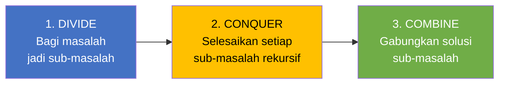

| Algoritma | Divide | Conquer | Combine |
|-----------|--------|---------|---------|
| **Merge Sort** | Bagi array jadi 2 bagian | Sort setiap bagian rekursif | **Merge** dua bagian terurut |
| **Quick Sort** | **Partition** berdasarkan pivot | Sort setiap partisi rekursif | Sudah terurut (tidak perlu merge) |

### 1.3 Ringkasan Perbandingan

| Algoritma | Best | Average | Worst | Stable? | In-place? | Space |
|-----------|------|---------|-------|---------|-----------|-------|
| Merge Sort | O(n log n) | O(n log n) | O(n log n) | ✅ Ya | ❌ Tidak | O(n) |
| Quick Sort | O(n log n) | O(n log n) | O(n²) | ❌ Tidak | ✅ Ya | O(log n) |
| Heap Sort | O(n log n) | O(n log n) | O(n log n) | ❌ Tidak | ✅ Ya | O(1) |

---

## 2. Merge Sort (30 menit)

### 2.1 Konsep

**Merge Sort** membagi array menjadi dua bagian sama besar, mengurutkan masing-masing bagian secara rekursif, lalu **menggabungkan (merge)** dua bagian yang sudah terurut.

> 💡 **Analogi:** Bayangkan Anda membagi setumpuk kartu menjadi dua tumpukan kecil. Minta dua teman masing-masing mengurutkan satu tumpukan. Setelah keduanya selesai, Anda tinggal menggabungkan dua tumpukan terurut menjadi satu — dengan cara mengambil kartu terkecil dari atas salah satu tumpukan secara bergantian.

### 2.2 Visualisasi Merge Sort

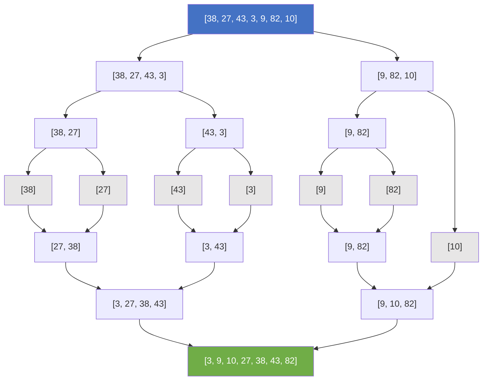

### 2.3 Flowchart Merge Sort

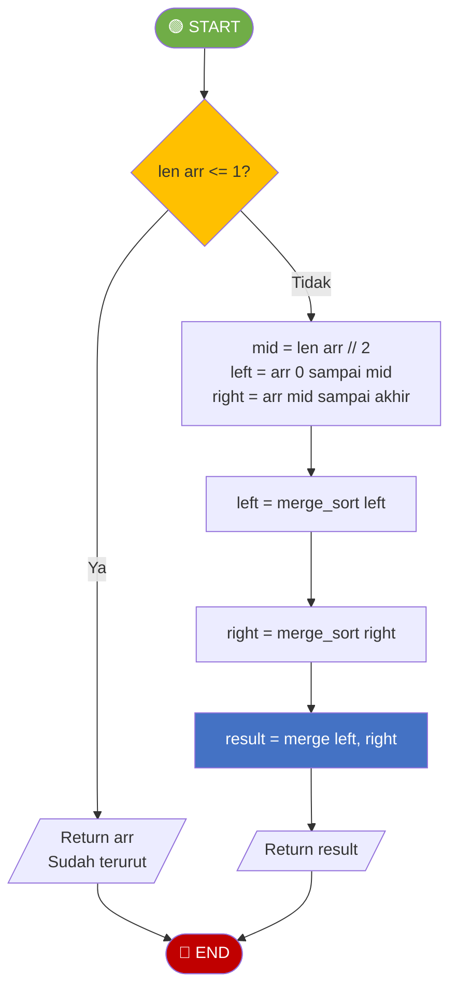

### 2.4 Flowchart Fungsi Merge

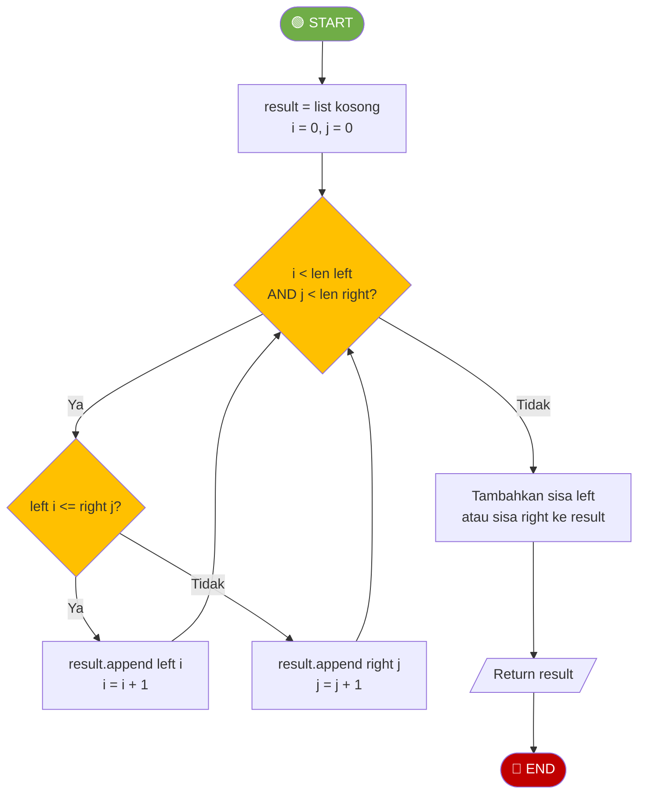

### 2.5 Kode Python

```python
def merge_sort(arr):
    """Merge Sort - O(n log n)"""
    if len(arr) <= 1:
        return arr
    
    mid = len(arr) // 2
    left = merge_sort(arr[:mid])      # Sort bagian kiri
    right = merge_sort(arr[mid:])     # Sort bagian kanan
    
    return merge(left, right)          # Gabungkan


def merge(left, right):
    """Menggabungkan dua array terurut menjadi satu array terurut"""
    result = []
    i = j = 0
    
    while i < len(left) and j < len(right):
        if left[i] <= right[j]:       # <= menjaga stabilitas
            result.append(left[i])
            i += 1
        else:
            result.append(right[j])
            j += 1
    
    result.extend(left[i:])           # Sisa dari left
    result.extend(right[j:])          # Sisa dari right
    return result
```

### 2.6 Trace Merge (Penggabungan)

**Merge `[3, 27, 38, 43]` dan `[9, 10, 82]`:**

| Langkah | i | j | Perbandingan | Aksi | result |
|---------|---|---|-------------|------|--------|
| 1 | 0 | 0 | 3 ≤ 9? Ya | Ambil 3 dari left | [3] |
| 2 | 1 | 0 | 27 ≤ 9? Tidak | Ambil 9 dari right | [3, 9] |
| 3 | 1 | 1 | 27 ≤ 10? Tidak | Ambil 10 dari right | [3, 9, 10] |
| 4 | 1 | 2 | 27 ≤ 82? Ya | Ambil 27 dari left | [3, 9, 10, 27] |
| 5 | 2 | 2 | 38 ≤ 82? Ya | Ambil 38 dari left | [3, 9, 10, 27, 38] |
| 6 | 3 | 2 | 43 ≤ 82? Ya | Ambil 43 dari left | [3, 9, 10, 27, 38, 43] |
| 7 | - | 2 | left habis | Sisa right: [82] | [3, 9, 10, 27, 38, 43, 82] |

### 2.7 Mengapa O(n log n)?

```
Level 0: 1 array ukuran n        → n operasi merge
Level 1: 2 array ukuran n/2      → n operasi merge  
Level 2: 4 array ukuran n/4      → n operasi merge
...
Level k: 2^k array ukuran n/2^k  → n operasi merge

Jumlah level = log₂(n)
Total operasi = n × log₂(n) = O(n log n)
```

### 2.8 Kelebihan dan Kekurangan Merge Sort

| Kelebihan | Kekurangan |
|-----------|------------|
| Selalu O(n log n) — tidak ada worst case buruk | Membutuhkan O(n) extra space |
| Stable sort | Tidak in-place |
| Cocok untuk data besar | Overhead rekursi |
| Mudah diparalelkan | Lebih lambat untuk data kecil dari Insertion Sort |

---

## 3. Quick Sort (30 menit)

### 3.1 Konsep

**Quick Sort** memilih sebuah elemen sebagai **pivot**, lalu **mempartisi** array sehingga elemen yang lebih kecil dari pivot berada di kiri, dan elemen yang lebih besar berada di kanan. Proses ini diulang secara rekursif.

> 💡 **Analogi:** Bayangkan mengelompokkan orang berdasarkan tinggi badan. Pilih satu orang sebagai patokan (pivot). Semua yang lebih pendek ke kiri, yang lebih tinggi ke kanan. Ulangi proses ini untuk setiap kelompok.

### 3.2 Visualisasi Quick Sort

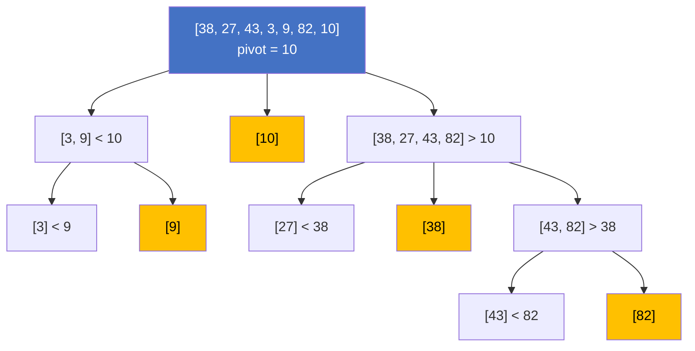

### 3.3 Flowchart Quick Sort

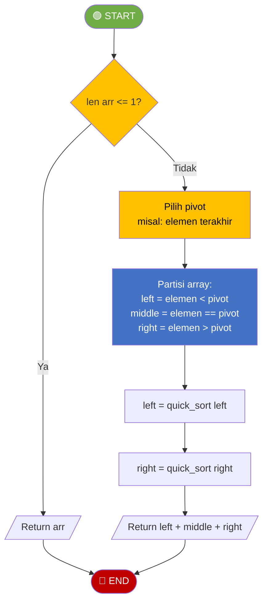

### 3.4 Kode Python (Versi Sederhana — Lomuto-style)

```python
def quick_sort(arr):
    """Quick Sort versi sederhana - O(n log n) average"""
    if len(arr) <= 1:
        return arr
    
    pivot = arr[-1]                              # Pilih elemen terakhir sebagai pivot
    left = [x for x in arr[:-1] if x < pivot]    # Elemen < pivot
    middle = [x for x in arr if x == pivot]      # Elemen == pivot
    right = [x for x in arr[:-1] if x > pivot]   # Elemen > pivot
    
    return quick_sort(left) + middle + quick_sort(right)
```

### 3.5 Kode Python (Versi In-place — Lomuto Partition)

```python
def quick_sort_inplace(arr, low=0, high=None):
    """Quick Sort in-place menggunakan Lomuto Partition"""
    if high is None:
        high = len(arr) - 1
    
    if low < high:
        pivot_idx = partition(arr, low, high)
        quick_sort_inplace(arr, low, pivot_idx - 1)   # Sort kiri pivot
        quick_sort_inplace(arr, pivot_idx + 1, high)   # Sort kanan pivot
    return arr


def partition(arr, low, high):
    """
    Lomuto Partition: pivot = elemen terakhir
    Pindahkan elemen < pivot ke kiri, >= pivot ke kanan
    Return: posisi akhir pivot
    """
    pivot = arr[high]
    i = low - 1               # Index elemen terkecil
    
    for j in range(low, high):
        if arr[j] <= pivot:
            i += 1
            arr[i], arr[j] = arr[j], arr[i]
    
    arr[i + 1], arr[high] = arr[high], arr[i + 1]  # Letakkan pivot
    return i + 1
```

### 3.6 Trace Partition

**Partition `[38, 27, 43, 3, 9, 82, 10]` dengan pivot = 10:**

| j | arr[j] | arr[j] ≤ 10? | Aksi | i | Array |
|---|--------|-------------|------|---|-------|
| 0 | 38 | Tidak | - | -1 | [38, 27, 43, 3, 9, 82, **10**] |
| 1 | 27 | Tidak | - | -1 | - |
| 2 | 43 | Tidak | - | -1 | - |
| 3 | 3 | Ya | i=0, swap arr[0]↔arr[3] | 0 | [**3**, 27, 43, **38**, 9, 82, 10] |
| 4 | 9 | Ya | i=1, swap arr[1]↔arr[4] | 1 | [3, **9**, 43, 38, **27**, 82, 10] |
| 5 | 82 | Tidak | - | 1 | - |
| — | — | Letakkan pivot | swap arr[2]↔arr[6] | — | [3, 9, **10**, 38, 27, 82, **43**] |

**Hasil partition:** `[3, 9, | 10 | 38, 27, 82, 43]` — pivot 10 di posisi index 2.

### 3.7 Mengapa Worst Case O(n²)?

Worst case terjadi ketika pivot selalu memilih **elemen terbesar atau terkecil** — array hanya berkurang 1 elemen setiap rekursi:

```
Level 0: n elemen   → n operasi partition
Level 1: n-1 elemen → n-1 operasi
Level 2: n-2 elemen → n-2 operasi
...
Total = n + (n-1) + (n-2) + ... + 1 = n(n+1)/2 = O(n²)
```

Ini terjadi pada **data yang sudah terurut** dengan pivot elemen terakhir.

**Solusi:** Gunakan **random pivot** atau **median-of-three**:

```python
import random

def partition_random(arr, low, high):
    """Partition dengan random pivot"""
    rand_idx = random.randint(low, high)
    arr[rand_idx], arr[high] = arr[high], arr[rand_idx]  # Pindahkan pivot random ke akhir
    return partition(arr, low, high)
```

### 3.8 Kelebihan dan Kekurangan Quick Sort

| Kelebihan | Kekurangan |
|-----------|------------|
| Average O(n log n), sangat cepat dalam praktik | Worst case O(n²) |
| In-place (O(log n) stack space) | Tidak stable |
| Cache-friendly | Pilihan pivot menentukan performa |
| Basis untuk banyak library sort | Rekursi dalam bisa stack overflow |

---

## 4. Heap Sort (20 menit)

### 4.1 Konsep

**Heap Sort** menggunakan struktur data **Binary Heap** untuk mengurutkan. Proses utamanya: bangun Max Heap dari array, lalu ambil elemen terbesar (root) satu per satu.

> 💡 **Binary Heap** adalah complete binary tree di mana setiap parent ≥ children (Max Heap) atau ≤ children (Min Heap).

**Properti Heap dalam Array:**
- Parent dari index `i` → index `(i-1) // 2`
- Left child dari index `i` → index `2*i + 1`
- Right child dari index `i` → index `2*i + 2`

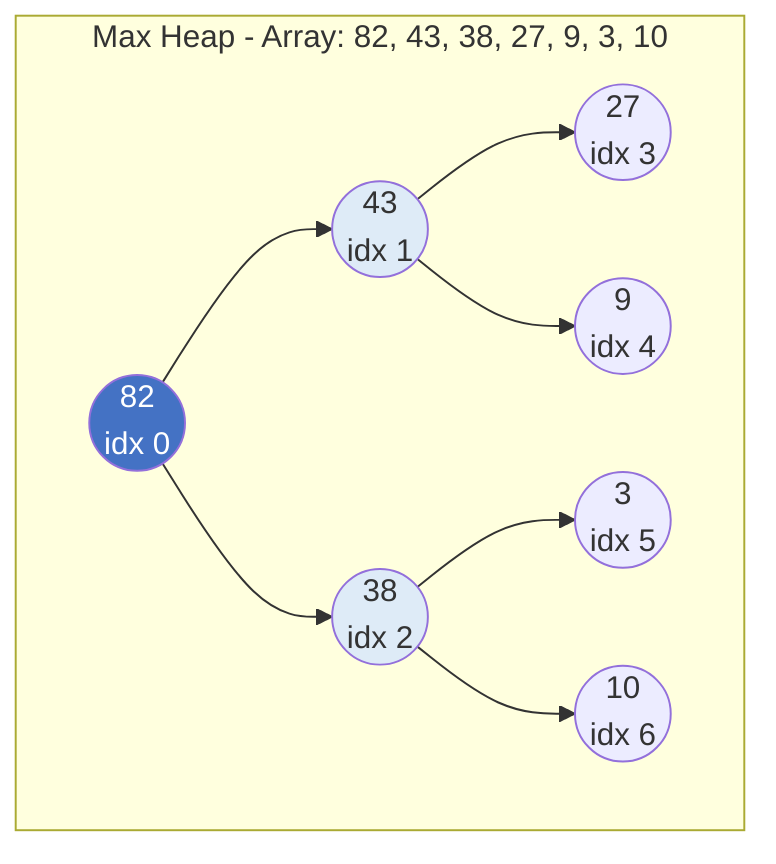

### 4.2 Algoritma Heap Sort

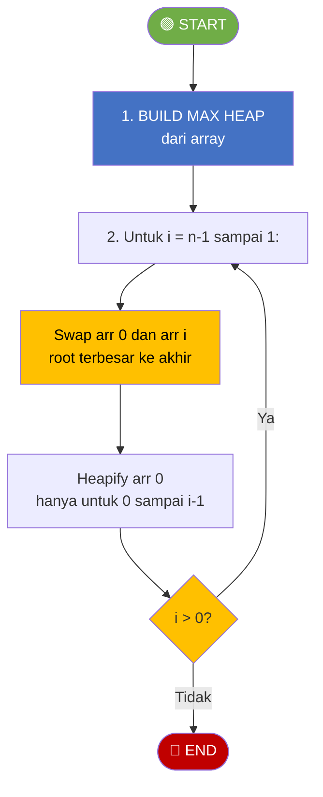

### 4.3 Flowchart Heapify (Sift Down)

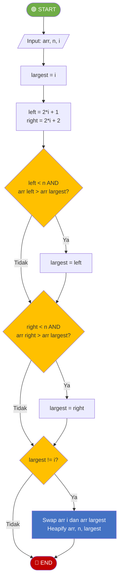

### 4.4 Kode Python

```python
def heap_sort(arr):
    """Heap Sort - O(n log n)"""
    n = len(arr)
    
    # Tahap 1: Build Max Heap
    for i in range(n // 2 - 1, -1, -1):
        heapify(arr, n, i)
    
    # Tahap 2: Extract elemen terbesar satu per satu
    for i in range(n - 1, 0, -1):
        arr[0], arr[i] = arr[i], arr[0]   # Pindahkan root (max) ke akhir
        heapify(arr, i, 0)                 # Heapify sisa heap
    
    return arr


def heapify(arr, n, i):
    """Memastikan subtree berakar di index i memenuhi Max Heap property"""
    largest = i
    left = 2 * i + 1
    right = 2 * i + 2
    
    if left < n and arr[left] > arr[largest]:
        largest = left
    
    if right < n and arr[right] > arr[largest]:
        largest = right
    
    if largest != i:
        arr[i], arr[largest] = arr[largest], arr[i]
        heapify(arr, n, largest)       # Rekursif ke bawah
```

### 4.5 Trace Heap Sort (Ringkas)

**Array awal:** `[38, 27, 43, 3, 9, 82, 10]`

**Tahap 1 — Build Max Heap:**

| Langkah | Heapify index | Array |
|---------|---------------|-------|
| i=2 | heapify(2): 43 vs 82,10 → swap 43↔82 | [38, 27, **82**, 3, 9, **43**, 10] |
| i=1 | heapify(1): 27 vs 3,9 → no swap | [38, 27, 82, 3, 9, 43, 10] |
| i=0 | heapify(0): 38 vs 27,82 → swap 38↔82, lalu 38 vs 43,10 → swap 38↔43 | [**82**, 27, **43**, 3, 9, **38**, 10] |

Max Heap: `[82, 27, 43, 3, 9, 38, 10]`

**Tahap 2 — Extract Max:**

| Langkah | Swap | Heapify | Array |
|---------|------|---------|-------|
| 1 | 82↔10, heapify [0..5] | [43, 27, 38, 3, 9, 10, \|82] |
| 2 | 43↔10, heapify [0..4] | [38, 27, 10, 3, 9, \|43, 82] |
| 3 | 38↔9, heapify [0..3] | [27, 9, 10, 3, \|38, 43, 82] |
| 4 | 27↔3, heapify [0..2] | [10, 9, 3, \|27, 38, 43, 82] |
| 5 | 10↔3, heapify [0..1] | [9, 3, \|10, 27, 38, 43, 82] |
| 6 | 9↔3 | [3, \|9, 10, 27, 38, 43, 82] |

**Hasil:** `[3, 9, 10, 27, 38, 43, 82]`

### 4.6 Kelebihan dan Kekurangan Heap Sort

| Kelebihan | Kekurangan |
|-----------|------------|
| Selalu O(n log n) | Tidak stable |
| In-place — O(1) extra space | Lebih lambat dari Quick Sort dalam praktik |
| Tidak ada worst case buruk | Tidak cache-friendly |
| Berguna untuk priority queue | Implementasi lebih kompleks |

---

## 5. Perbandingan dan Rangkuman (10 menit)

### 5.1 Tabel Perbandingan Lengkap

| Aspek | Merge Sort | Quick Sort | Heap Sort |
|-------|------------|------------|-----------|
| **Best** | O(n log n) | O(n log n) | O(n log n) |
| **Average** | O(n log n) | O(n log n) | O(n log n) |
| **Worst** | O(n log n) | O(n²) | O(n log n) |
| **Space** | O(n) | O(log n) | O(1) |
| **Stable** | ✅ Ya | ❌ Tidak | ❌ Tidak |
| **In-place** | ❌ Tidak | ✅ Ya | ✅ Ya |
| **Cache** | Sedang | Baik | Buruk |
| **Paralel** | Mudah | Sedang | Sulit |

### 5.2 Kapan Pakai Yang Mana?

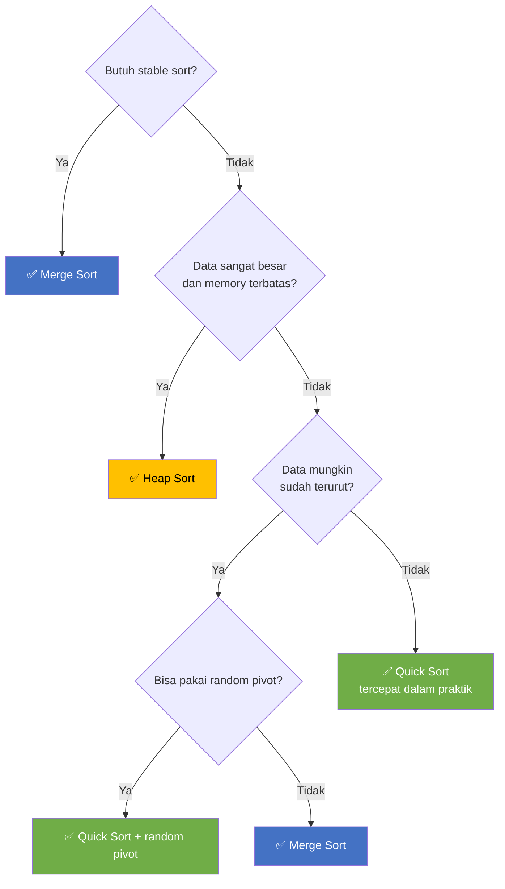

> 💡 **Dalam praktik:** Python `sorted()` dan `list.sort()` menggunakan **Timsort** — hybrid Merge Sort + Insertion Sort. Java `Arrays.sort()` menggunakan **Dual-Pivot Quick Sort** untuk primitif dan **Timsort** untuk objek.

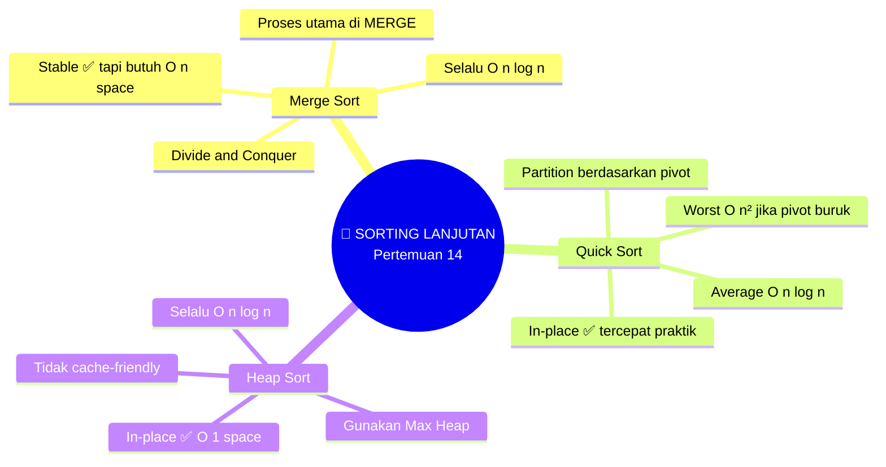

---

# BAGIAN B: PRAKTIKUM DI LAB (100 Menit)

## Tujuan Praktikum
Mengimplementasikan Merge Sort, Quick Sort, dan Heap Sort, serta membandingkan performa dengan sorting dasar.

> ⚠️ **Catatan:** Kode yang dibuat di praktikum ini akan **dikembangkan lebih lanjut** di Tugas Terstruktur.

---

## Praktikum 14.1: Implementasi Merge Sort (30 menit)

### Kode Praktikum

```python
"""
============================================================
PRAKTIKUM 14.1: Implementasi Merge Sort
============================================================
Nama  : ____________________
NIM   : ____________________
Kelas : ____________________

Instruksi: 
1. Implementasikan merge_sort dan merge
2. Jalankan test cases
3. SIMPAN FILE INI
============================================================
"""

def merge_sort(arr):
    """
    Merge Sort: Divide → Sort → Merge
    Return: array terurut (baru, tidak in-place)
    """
    # TODO: Implementasikan berdasarkan flowchart
    # Base case: len(arr) <= 1 → return arr
    # Divide: mid = len(arr) // 2
    # Conquer: rekursi left dan right
    # Combine: merge(left, right)
    pass


def merge(left, right):
    """
    Menggabungkan dua array terurut menjadi satu array terurut
    Berdasarkan flowchart MERGE
    """
    # TODO: Implementasikan
    # 1. Buat result kosong, i=0, j=0
    # 2. Selama i < len(left) DAN j < len(right):
    #    - Jika left[i] <= right[j]: append left[i], i++
    #    - Else: append right[j], j++
    # 3. Append sisa left atau right
    pass


def merge_sort_verbose(arr, depth=0):
    """
    Merge Sort dengan trace visual (untuk debugging)
    """
    indent = "  " * depth
    print(f"{indent}merge_sort({arr})")
    
    if len(arr) <= 1:
        print(f"{indent}→ return {arr}")
        return arr
    
    mid = len(arr) // 2
    left = merge_sort_verbose(arr[:mid], depth + 1)
    right = merge_sort_verbose(arr[mid:], depth + 1)
    result = merge(left, right)
    print(f"{indent}→ merge({left}, {right}) = {result}")
    return result


# === TEST CASES ===
if __name__ == "__main__":
    print("=" * 50)
    print("TEST MERGE SORT")
    print("=" * 50)
    
    test_cases = [
        ([38, 27, 43, 3, 9, 82, 10], [3, 9, 10, 27, 38, 43, 82]),
        ([5, 4, 3, 2, 1], [1, 2, 3, 4, 5]),
        ([1, 2, 3, 4, 5], [1, 2, 3, 4, 5]),
        ([1], [1]),
        ([], []),
        ([3, 3, 1, 1, 2, 2], [1, 1, 2, 2, 3, 3]),
    ]
    
    for i, (input_arr, expected) in enumerate(test_cases):
        result = merge_sort(input_arr.copy())
        assert result == expected, f"GAGAL Test {i+1}: {input_arr} → {result}"
    print(f"✓ Semua {len(test_cases)} test PASSED!")
    
    # Test merge saja
    assert merge([1, 3, 5], [2, 4, 6]) == [1, 2, 3, 4, 5, 6], "GAGAL merge"
    assert merge([], [1, 2]) == [1, 2], "GAGAL merge empty"
    assert merge([1, 2], []) == [1, 2], "GAGAL merge empty"
    print("✓ Merge function tests PASSED!")
    
    # Test stability
    data = [(3, 'a'), (1, 'b'), (3, 'c'), (1, 'd')]
    
    def merge_sort_stable(arr):
        if len(arr) <= 1:
            return arr
        mid = len(arr) // 2
        left = merge_sort_stable(arr[:mid])
        right = merge_sort_stable(arr[mid:])
        result = []
        i = j = 0
        while i < len(left) and j < len(right):
            if left[i][0] <= right[j][0]:
                result.append(left[i])
                i += 1
            else:
                result.append(right[j])
                j += 1
        result.extend(left[i:])
        result.extend(right[j:])
        return result
    
    sorted_data = merge_sort_stable(data)
    assert sorted_data == [(1, 'b'), (1, 'd'), (3, 'a'), (3, 'c')], f"GAGAL stability: {sorted_data}"
    print("✓ Stability test PASSED!")
    
    # Verbose trace
    print("\n--- Trace Merge Sort ---")
    merge_sort_verbose([38, 27, 43, 3])
    
    print("\n" + "=" * 50)
    print("🎉 SEMUA TEST PASSED!")
    print("=" * 50)
```

---

## Praktikum 14.2: Implementasi Quick Sort (35 menit)

### Kode Praktikum

```python
"""
============================================================
PRAKTIKUM 14.2: Implementasi Quick Sort
============================================================
Nama  : ____________________
NIM   : ____________________
Kelas : ____________________

Instruksi: 
1. Implementasikan quick_sort (simple) dan in-place
2. Jalankan test cases
============================================================
"""

import random


def quick_sort_simple(arr):
    """
    Quick Sort versi sederhana (tidak in-place)
    Mudah dipahami, tapi butuh extra space
    """
    # TODO: Implementasikan berdasarkan flowchart
    # Base case: len(arr) <= 1
    # Pilih pivot (elemen terakhir)
    # Partisi: left (< pivot), middle (== pivot), right (> pivot)
    # Return quick_sort(left) + middle + quick_sort(right)
    pass


def quick_sort_inplace(arr, low=0, high=None):
    """
    Quick Sort in-place menggunakan Lomuto Partition
    """
    # TODO: Implementasikan
    # Base case: low >= high → return
    # pivot_idx = partition(arr, low, high)
    # Rekursi kiri dan kanan
    pass


def partition(arr, low, high):
    """
    Lomuto Partition
    Pivot = elemen terakhir (arr[high])
    Return: posisi akhir pivot
    """
    # TODO: Implementasikan berdasarkan flowchart PARTITION
    # 1. pivot = arr[high]
    # 2. i = low - 1
    # 3. Untuk j dari low sampai high-1:
    #    Jika arr[j] <= pivot: i++, swap arr[i]↔arr[j]
    # 4. Swap arr[i+1]↔arr[high] (letakkan pivot)
    # 5. Return i+1
    pass


def quick_sort_random(arr, low=0, high=None):
    """Quick Sort dengan random pivot"""
    if high is None:
        high = len(arr) - 1
    
    if low < high:
        # TODO: Implementasikan
        # 1. Pilih random index antara low dan high
        # 2. Swap elemen random ke posisi high
        # 3. Partition biasa
        # 4. Rekursi kiri dan kanan
        pass
    return arr


# === TEST CASES ===
if __name__ == "__main__":
    print("=" * 50)
    print("TEST QUICK SORT")
    print("=" * 50)
    
    test_cases = [
        ([38, 27, 43, 3, 9, 82, 10], [3, 9, 10, 27, 38, 43, 82]),
        ([5, 4, 3, 2, 1], [1, 2, 3, 4, 5]),
        ([1, 2, 3, 4, 5], [1, 2, 3, 4, 5]),
        ([1], [1]),
        ([], []),
        ([3, 3, 1, 1, 2, 2], [1, 1, 2, 2, 3, 3]),
        ([7, 7, 7, 7], [7, 7, 7, 7]),
    ]
    
    # Test Simple Quick Sort
    print("\n--- Quick Sort (Simple) ---")
    for i, (input_arr, expected) in enumerate(test_cases):
        result = quick_sort_simple(input_arr.copy())
        assert result == expected, f"GAGAL Test {i+1}: {input_arr} → {result}"
    print(f"✓ Semua {len(test_cases)} test PASSED!")
    
    # Test In-place Quick Sort
    print("\n--- Quick Sort (In-place) ---")
    for i, (input_arr, expected) in enumerate(test_cases):
        arr = input_arr.copy()
        quick_sort_inplace(arr, 0, len(arr) - 1 if arr else 0)
        assert arr == expected, f"GAGAL Test {i+1}: {input_arr} → {arr}"
    print(f"✓ Semua {len(test_cases)} test PASSED!")
    
    # Test Random Pivot
    print("\n--- Quick Sort (Random Pivot) ---")
    for i, (input_arr, expected) in enumerate(test_cases):
        arr = input_arr.copy()
        quick_sort_random(arr, 0, len(arr) - 1 if arr else 0)
        assert arr == expected, f"GAGAL Test {i+1}: {input_arr} → {arr}"
    print(f"✓ Semua {len(test_cases)} test PASSED!")
    
    # Test partition
    arr = [38, 27, 43, 3, 9, 82, 10]
    pivot_pos = partition(arr, 0, 6)
    assert arr[pivot_pos] == 10, f"GAGAL: pivot harus di posisi benar"
    assert all(arr[j] <= 10 for j in range(pivot_pos)), "GAGAL: kiri harus <= pivot"
    assert all(arr[j] >= 10 for j in range(pivot_pos, len(arr))), "GAGAL: kanan harus >= pivot"
    print(f"✓ Partition test PASSED! (pivot 10 di index {pivot_pos})")
    
    print("\n" + "=" * 50)
    print("🎉 SEMUA TEST PASSED!")
    print("=" * 50)
```

---

## Praktikum 14.3: Implementasi Heap Sort (35 menit)

### Kode Praktikum

```python
"""
============================================================
PRAKTIKUM 14.3: Implementasi Heap Sort
============================================================
Nama  : ____________________
NIM   : ____________________
Kelas : ____________________

Instruksi: 
1. Implementasikan heapify dan heap_sort
2. Jalankan test cases
============================================================
"""

def heapify(arr, n, i):
    """
    Memastikan subtree berakar di index i memenuhi Max Heap property
    n: ukuran heap (bukan ukuran array)
    Berdasarkan flowchart HEAPIFY
    """
    # TODO: Implementasikan
    # 1. largest = i
    # 2. left = 2*i + 1, right = 2*i + 2
    # 3. Jika left < n dan arr[left] > arr[largest] → largest = left
    # 4. Jika right < n dan arr[right] > arr[largest] → largest = right
    # 5. Jika largest != i → swap dan heapify(arr, n, largest)
    pass


def heap_sort(arr):
    """
    Heap Sort - O(n log n) in-place
    Tahap 1: Build Max Heap
    Tahap 2: Extract max satu per satu
    """
    # TODO: Implementasikan
    # Tahap 1: Build Max Heap
    # for i in range(n//2 - 1, -1, -1): heapify(arr, n, i)
    #
    # Tahap 2: Extract max
    # for i in range(n-1, 0, -1):
    #   swap arr[0]↔arr[i]
    #   heapify(arr, i, 0)
    pass


def heap_sort_verbose(arr):
    """Heap Sort dengan trace visual"""
    n = len(arr)
    print(f"Array awal: {arr}")
    
    # Build Max Heap
    print("\n--- Build Max Heap ---")
    for i in range(n // 2 - 1, -1, -1):
        heapify(arr, n, i)
        print(f"  heapify(i={i}): {arr}")
    print(f"Max Heap: {arr}")
    
    # Extract max
    print("\n--- Extract Max ---")
    for i in range(n - 1, 0, -1):
        arr[0], arr[i] = arr[i], arr[0]
        heapify(arr, i, 0)
        sorted_part = arr[i:]
        heap_part = arr[:i]
        print(f"  step {n-i}: swap → heap={heap_part}, sorted={sorted_part}")
    
    print(f"\nHasil: {arr}")
    return arr


# === TEST CASES ===
if __name__ == "__main__":
    print("=" * 50)
    print("TEST HEAP SORT")
    print("=" * 50)
    
    test_cases = [
        ([38, 27, 43, 3, 9, 82, 10], [3, 9, 10, 27, 38, 43, 82]),
        ([5, 4, 3, 2, 1], [1, 2, 3, 4, 5]),
        ([1, 2, 3, 4, 5], [1, 2, 3, 4, 5]),
        ([1], [1]),
        ([], []),
        ([3, 3, 1, 1, 2, 2], [1, 1, 2, 2, 3, 3]),
    ]
    
    for i, (input_arr, expected) in enumerate(test_cases):
        arr = input_arr.copy()
        result = heap_sort(arr)
        assert result == expected, f"GAGAL Test {i+1}: {input_arr} → {result}"
    print(f"✓ Semua {len(test_cases)} test PASSED!")
    
    # Test heapify
    arr = [3, 9, 82]
    heapify(arr, 3, 0)
    assert arr[0] == 82, f"GAGAL heapify: root harus 82, dapat {arr[0]}"
    print("✓ Heapify test PASSED!")
    
    # Verbose trace
    print("\n--- Trace Heap Sort ---")
    heap_sort_verbose([38, 27, 43, 3, 9, 82, 10])
    
    print("\n" + "=" * 50)
    print("🎉 SEMUA TEST PASSED!")
    print("=" * 50)
```

---

# BAGIAN C: TUGAS TERSTRUKTUR (120 Menit)

> 📝 **Pengembangan dari Praktikum**
> 
> Tugas ini mengembangkan kode yang sudah dibuat di praktikum.
> Kerjakan setelah praktikum selesai, kumpulkan pada pertemuan berikutnya.

---

## 📋 Informasi Pengumpulan

| Item | Keterangan |
|------|------------|
| **Deadline** | Pertemuan 15 (sebelum kuliah dimulai) |
| **Format** | File Python (.py) |
| **Nama File** | `Tugas14_NIM_Nama.py` |
| **Pengumpulan** | Upload ke github |

---

## Tugas 1: Perbandingan Sorting Dasar vs Lanjutan (40 menit)

### Template Kode

```python
"""
============================================================
TUGAS TERSTRUKTUR 14.1: Perbandingan Sorting Dasar vs Lanjutan
============================================================
Nama  : ____________________
NIM   : ____________________
Kelas : ____________________
============================================================
"""

import time
import random


# ============ SORTING DASAR ============
def insertion_sort(arr):
    for i in range(1, len(arr)):
        key = arr[i]
        j = i - 1
        while j >= 0 and arr[j] > key:
            arr[j + 1] = arr[j]
            j -= 1
        arr[j + 1] = key
    return arr


def selection_sort(arr):
    n = len(arr)
    for i in range(n - 1):
        min_idx = i
        for j in range(i + 1, n):
            if arr[j] < arr[min_idx]:
                min_idx = j
        if min_idx != i:
            arr[i], arr[min_idx] = arr[min_idx], arr[i]
    return arr


# ============ SORTING LANJUTAN ============
# COPY dari praktikum 14.1, 14.2, 14.3:

def merge_sort(arr):
    # COPY dari praktikum
    pass

def quick_sort_inplace(arr, low=0, high=None):
    # COPY dari praktikum
    pass

def heap_sort(arr):
    # COPY dari praktikum
    pass


# ============ BENCHMARK ============
def measure_sort(sort_func, arr, inplace=False):
    data = arr.copy()
    start = time.perf_counter()
    if inplace:
        sort_func(data)
    else:
        sort_func(data)
    end = time.perf_counter()
    return end - start


if __name__ == "__main__":
    print("=" * 80)
    print("PERBANDINGAN: SORTING DASAR O(n²) vs SORTING LANJUTAN O(n log n)")
    print("=" * 80)
    
    sizes = [500, 1000, 2000, 5000, 10000, 20000]
    
    # ============ Random Data ============
    print("\n--- Data Acak (Random) ---")
    print(f"{'n':>7} | {'Insertion':>10} | {'Selection':>10} | "
          f"{'Merge':>10} | {'Quick':>10} | {'Heap':>10} | {'Python':>10}")
    print("-" * 85)
    
    for n in sizes:
        data = [random.randint(1, n * 10) for _ in range(n)]
        
        t_ins = measure_sort(insertion_sort, data)
        t_sel = measure_sort(selection_sort, data)
        t_merge = measure_sort(merge_sort, data)
        
        # Quick Sort in-place
        qdata = data.copy()
        start = time.perf_counter()
        quick_sort_inplace(qdata, 0, len(qdata) - 1)
        t_quick = time.perf_counter() - start
        
        t_heap = measure_sort(heap_sort, data)
        
        # Python built-in
        start = time.perf_counter()
        sorted(data)
        t_python = time.perf_counter() - start
        
        print(f"{n:>7} | {t_ins:>9.4f}s | {t_sel:>9.4f}s | "
              f"{t_merge:>9.4f}s | {t_quick:>9.4f}s | {t_heap:>9.4f}s | {t_python:>9.4f}s")
    
    # ============ Nearly Sorted ============
    print("\n--- Data Hampir Terurut ---")
    print(f"{'n':>7} | {'Insertion':>10} | {'Merge':>10} | {'Quick':>10} | {'Heap':>10}")
    print("-" * 55)
    
    for n in sizes:
        data = list(range(n))
        # Tukar 5% elemen secara random
        for _ in range(n // 20):
            i, j = random.randint(0, n-1), random.randint(0, n-1)
            data[i], data[j] = data[j], data[i]
        
        t_ins = measure_sort(insertion_sort, data)
        t_merge = measure_sort(merge_sort, data)
        
        qdata = data.copy()
        start = time.perf_counter()
        quick_sort_inplace(qdata, 0, len(qdata) - 1)
        t_quick = time.perf_counter() - start
        
        t_heap = measure_sort(heap_sort, data)
        
        print(f"{n:>7} | {t_ins:>9.4f}s | {t_merge:>9.4f}s | "
              f"{t_quick:>9.4f}s | {t_heap:>9.4f}s")
    
    print("=" * 80)


# ============================================================
# JAWABAN TUGAS (ISI DI BAWAH INI)
# ============================================================
"""
BAGIAN A: TABEL HASIL OBSERVASI

| n | Insertion | Selection | Merge | Quick | Heap | Python |
|---|-----------|-----------|-------|-------|------|--------|
| 1000 | | | | | | |
| 5000 | | | | | | |
| 10000 | | | | | | |
| 20000 | | | | | | |


BAGIAN B: PERTANYAAN

1. Pada ukuran n berapa mulai terlihat perbedaan signifikan antara 
   O(n²) dan O(n log n)?
   Jawab:


2. Manakah yang paling cepat di antara Merge, Quick, dan Heap Sort? 
   Mengapa?
   Jawab:


3. Mengapa Python built-in sort (Timsort) paling cepat?
   Jawab:


4. Pada data hampir terurut, Insertion Sort bisa lebih cepat dari 
   sorting lanjutan untuk n kecil. Pada n berapa batasnya?
   Jawab:


5. Jika Anda diminta merancang sorting library dari nol, algoritma 
   mana yang akan Anda pilih sebagai basis? Jelaskan!
   Jawab:

"""
```

---

## Tugas 2: Studi Kasus — Sorting pada Data Kompleks (40 menit)

### Deskripsi
Implementasikan sorting lanjutan untuk mengurutkan data kompleks (objek/dict) dengan berbagai kriteria.

### Template Kode

```python
"""
============================================================
TUGAS TERSTRUKTUR 14.2: Sorting pada Data Kompleks
============================================================
Nama  : ____________________
NIM   : ____________________
Kelas : ____________________
============================================================
"""

def merge_sort_by_key(arr, key=None, reverse=False):
    """
    Merge Sort yang mendukung custom key dan reverse
    Stable sort — menjaga urutan relatif elemen dengan key sama
    """
    # TODO: Implementasikan
    # Modifikasi merge_sort agar menggunakan key() untuk perbandingan
    # Jika reverse=True, balik urutan
    pass


def quick_sort_by_key(arr, key=None, reverse=False):
    """
    Quick Sort yang mendukung custom key dan reverse
    """
    # TODO: Implementasikan
    pass


def multi_key_sort(arr, keys):
    """
    Sort berdasarkan multiple keys (prioritas dari kiri ke kanan)
    keys: list of tuples (key_func, reverse)
    Contoh: keys=[(lambda x: x['grade'], False), (lambda x: x['nama'], False)]
    
    Trick: Sort dari key terakhir ke pertama menggunakan stable sort!
    """
    # TODO: Implementasikan
    # Iterasi keys dari belakang ke depan
    # Gunakan merge_sort_by_key (stable) untuk setiap key
    pass


# === TEST CASES ===
if __name__ == "__main__":
    print("=" * 60)
    print("TEST SORTING DATA KOMPLEKS")
    print("=" * 60)
    
    # Test 1: Sort dict by field
    products = [
        {"nama": "Laptop", "harga": 15000000, "rating": 4.5},
        {"nama": "Mouse", "harga": 250000, "rating": 4.8},
        {"nama": "Keyboard", "harga": 500000, "rating": 4.2},
        {"nama": "Monitor", "harga": 3000000, "rating": 4.7},
        {"nama": "Headset", "harga": 750000, "rating": 4.5},
    ]
    
    # Sort by harga ascending
    result = merge_sort_by_key(products.copy(), key=lambda x: x["harga"])
    names = [p["nama"] for p in result]
    assert names == ["Mouse", "Keyboard", "Headset", "Monitor", "Laptop"], f"GAGAL: {names}"
    print(f"✓ Test 1 PASSED: Sort by harga = {names}")
    
    # Test 2: Sort by rating descending
    result = merge_sort_by_key(products.copy(), key=lambda x: x["rating"], reverse=True)
    names = [p["nama"] for p in result]
    assert names[0] == "Mouse", f"GAGAL: rating tertinggi harus Mouse"
    print(f"✓ Test 2 PASSED: Sort by rating DESC = {names}")
    
    # Test 3: Sort by nama ascending
    result = quick_sort_by_key(products.copy(), key=lambda x: x["nama"])
    names = [p["nama"] for p in result]
    assert names == ["Headset", "Keyboard", "Laptop", "Monitor", "Mouse"], f"GAGAL: {names}"
    print(f"✓ Test 3 PASSED: Sort by nama = {names}")
    
    # Test 4: Multi-key sort
    students = [
        {"nama": "Andi", "grade": "B", "nilai": 78},
        {"nama": "Budi", "grade": "A", "nilai": 92},
        {"nama": "Citra", "grade": "B", "nilai": 85},
        {"nama": "Dina", "grade": "A", "nilai": 88},
        {"nama": "Eko", "grade": "C", "nilai": 65},
        {"nama": "Fitri", "grade": "A", "nilai": 90},
    ]
    
    # Sort by grade ascending, then by nama ascending
    result = multi_key_sort(students.copy(), [
        (lambda x: x["grade"], False),
        (lambda x: x["nama"], False),
    ])
    result_info = [(s["grade"], s["nama"]) for s in result]
    expected = [("A", "Budi"), ("A", "Dina"), ("A", "Fitri"),
                ("B", "Andi"), ("B", "Citra"), ("C", "Eko")]
    assert result_info == expected, f"GAGAL: {result_info}"
    print(f"✓ Test 4 PASSED: Multi-key sort = {result_info}")
    
    # Test 5: Sort by grade ascending, then by nilai descending
    result = multi_key_sort(students.copy(), [
        (lambda x: x["grade"], False),
        (lambda x: x["nilai"], True),
    ])
    result_info = [(s["grade"], s["nama"], s["nilai"]) for s in result]
    # A: Budi(92) > Fitri(90) > Dina(88)
    assert result_info[0] == ("A", "Budi", 92), f"GAGAL: {result_info}"
    assert result_info[1] == ("A", "Fitri", 90), f"GAGAL: {result_info}"
    print(f"✓ Test 5 PASSED: Grade ASC, Nilai DESC")
    
    print("\n" + "=" * 60)
    print("🎉 SEMUA TEST PASSED!")
    print("=" * 60)
```

---

## Tugas 3: Counting Sort dan Hybrid Sort (40 menit)

### Deskripsi
Implementasikan **Counting Sort** (sorting non-comparison O(n)) dan **Hybrid Sort** yang menggabungkan Quick Sort + Insertion Sort.

### Template Kode

```python
"""
============================================================
TUGAS TERSTRUKTUR 14.3: Counting Sort dan Hybrid Sort
============================================================
Nama  : ____________________
NIM   : ____________________
Kelas : ____________________
============================================================
"""

import random
import time


def counting_sort(arr):
    """
    Counting Sort - O(n + k) di mana k = range nilai
    Hanya untuk integer non-negatif
    STABLE sort
    """
    # TODO: Implementasikan
    # 1. Cari nilai max di arr
    # 2. Buat count array ukuran max+1, isi 0
    # 3. Hitung frekuensi setiap elemen
    # 4. Hitung cumulative sum (prefix sum)
    # 5. Bangun output array dari belakang (untuk stability)
    pass


def hybrid_sort(arr, threshold=32):
    """
    Hybrid Sort: Quick Sort + Insertion Sort
    Jika sub-array kecil (len <= threshold), gunakan Insertion Sort
    Ini mirip dengan strategi Timsort dan IntroSort
    """
    # TODO: Implementasikan
    # Jika len(arr) <= threshold → gunakan insertion_sort
    # Jika tidak → gunakan quick_sort dengan random pivot
    pass


def _insertion_sort_range(arr, low, high):
    """Insertion Sort pada range [low, high]"""
    for i in range(low + 1, high + 1):
        key = arr[i]
        j = i - 1
        while j >= low and arr[j] > key:
            arr[j + 1] = arr[j]
            j -= 1
        arr[j + 1] = key


def _hybrid_sort_helper(arr, low, high, threshold):
    """Helper rekursif untuk hybrid sort"""
    # TODO: Implementasikan
    # Jika high - low + 1 <= threshold → insertion_sort_range
    # Else → partition + rekursi
    pass


# === TEST CASES ===
if __name__ == "__main__":
    print("=" * 60)
    print("TEST COUNTING SORT DAN HYBRID SORT")
    print("=" * 60)
    
    # Test 1: Counting Sort
    arr = [4, 2, 2, 8, 3, 3, 1]
    result = counting_sort(arr.copy())
    assert result == [1, 2, 2, 3, 3, 4, 8], f"GAGAL: {result}"
    print(f"✓ Test 1 PASSED: Counting Sort = {result}")
    
    # Test 2: Counting Sort stability
    data = [(4, 'a'), (2, 'b'), (4, 'c'), (2, 'd'), (1, 'e')]
    # Sort by first element using counting sort idea
    max_val = max(d[0] for d in data)
    count = [0] * (max_val + 1)
    for d in data:
        count[d[0]] += 1
    for i in range(1, len(count)):
        count[i] += count[i-1]
    output = [None] * len(data)
    for d in reversed(data):
        count[d[0]] -= 1
        output[count[d[0]]] = d
    assert output == [(1, 'e'), (2, 'b'), (2, 'd'), (4, 'a'), (4, 'c')], f"GAGAL stability"
    print("✓ Test 2 PASSED: Counting Sort is stable")
    
    # Test 3: Hybrid Sort
    arr = [random.randint(1, 1000) for _ in range(100)]
    result = hybrid_sort(arr.copy())
    assert result == sorted(arr), "GAGAL"
    print("✓ Test 3 PASSED: Hybrid Sort (n=100)")
    
    # Test 4: Hybrid Sort larger
    arr = [random.randint(1, 100000) for _ in range(10000)]
    result = hybrid_sort(arr.copy())
    assert result == sorted(arr), "GAGAL"
    print("✓ Test 4 PASSED: Hybrid Sort (n=10000)")
    
    # Test 5: Perbandingan performa
    print("\n--- Perbandingan Quick Sort vs Hybrid Sort ---")
    print(f"{'n':>7} | {'Quick Sort':>12} | {'Hybrid Sort':>12} | {'Python sort':>12}")
    print("-" * 50)
    
    def quick_sort_basic(arr):
        if len(arr) <= 1:
            return arr
        pivot = arr[len(arr) // 2]
        left = [x for x in arr if x < pivot]
        mid = [x for x in arr if x == pivot]
        right = [x for x in arr if x > pivot]
        return quick_sort_basic(left) + mid + quick_sort_basic(right)
    
    for n in [1000, 5000, 10000, 50000]:
        data = [random.randint(1, n * 10) for _ in range(n)]
        
        start = time.perf_counter()
        quick_sort_basic(data.copy())
        t_quick = time.perf_counter() - start
        
        start = time.perf_counter()
        hybrid_sort(data.copy())
        t_hybrid = time.perf_counter() - start
        
        start = time.perf_counter()
        sorted(data)
        t_python = time.perf_counter() - start
        
        print(f"{n:>7} | {t_quick:>11.4f}s | {t_hybrid:>11.4f}s | {t_python:>11.4f}s")
    
    print("\n" + "=" * 60)
    print("🎉 SEMUA TEST PASSED!")
    print("=" * 60)
```

---

# BAGIAN D: BELAJAR MANDIRI (190 Menit)

> 📚 **Bagian ini dikerjakan mahasiswa secara mandiri di luar kelas**
> **Tidak dikumpulkan**, tetapi penting untuk pemahaman materi.

---

## D1. Membaca Referensi (60 menit)

### Bacaan Wajib:
1. **Goodrich et al., Chapter 12.2-12.5** - Merge Sort, Quick Sort, Sorting Lower Bound
2. **Cormen et al. (CLRS), Chapter 6, 7, 8** - Heapsort, Quicksort, Sorting in Linear Time

### Bacaan Tambahan:
- [Visualgo - Sorting](https://visualgo.net/en/sorting)
- [GeeksforGeeks - Merge Sort](https://www.geeksforgeeks.org/merge-sort/)
- [GeeksforGeeks - Quick Sort](https://www.geeksforgeeks.org/quick-sort/)
- [GeeksforGeeks - Heap Sort](https://www.geeksforgeeks.org/heap-sort/)

---

## D2. Video Tutorial (40 menit)

Tonton dan buat catatan:

1. **Merge Sort - CS50** (~13 menit)
   - https://www.youtube.com/watch?v=Ns7tGNbtvV4

2. **Quick Sort - mycodeschool** (~13 menit)
   - https://www.youtube.com/watch?v=COk73cpQbFQ

3. **Heap Sort - Abdul Bari** (~14 menit)
   - https://www.youtube.com/watch?v=HqPJF2L5h9U

---

## D3. Latihan Mandiri (60 menit)

### Soal Pilihan Ganda

**1.** Prinsip Divide and Conquer terdiri dari langkah...
- [ ] a. Split, Process, Join
- [ ] b. Divide, Conquer, Combine
- [ ] c. Input, Process, Output
- [ ] d. Plan, Execute, Review

**2.** Merge Sort memiliki worst case...
- [ ] a. O(n)
- [ ] b. O(n log n)
- [ ] c. O(n²)
- [ ] d. O(log n)

**3.** Quick Sort worst case O(n²) terjadi ketika...
- [ ] a. Data acak
- [ ] b. Pivot selalu elemen terbesar/terkecil
- [ ] c. Data memiliki duplikat
- [ ] d. Array sangat besar

**4.** Algoritma sorting lanjutan yang membutuhkan O(n) extra space adalah...
- [ ] a. Quick Sort
- [ ] b. Heap Sort
- [ ] c. Merge Sort
- [ ] d. Insertion Sort

**5.** Heap Sort menggunakan struktur data...
- [ ] a. Stack
- [ ] b. Queue
- [ ] c. Binary Heap (Max Heap)
- [ ] d. Binary Search Tree

### Latihan Coding (Opsional)

Kerjakan di platform online:
- **LeetCode Easy #912** - Sort an Array
- **LeetCode Medium #148** - Sort List (Merge Sort pada Linked List)
- **LeetCode Medium #215** - Kth Largest Element (Quick Select / Heap)
- **LeetCode Medium #75** - Sort Colors (Dutch National Flag = 3-way partition)
- **LeetCode Hard #23** - Merge k Sorted Lists

---

## D4. Persiapan Pertemuan Berikutnya (30 menit)

Baca materi tentang **Struktur Data untuk Big Data & AI**:
- Apa itu Trie dan bagaimana cara kerjanya?
- Apa itu Tensor dan hubungannya dengan AI/Machine Learning?
- Review semua materi untuk persiapan UAS

---

---

**Selamat Belajar! 🚀**

*Modul ini disusun oleh Aidil Saputra Kirsan (myst-tech.com), Institut Teknologi Kalimantan.*
